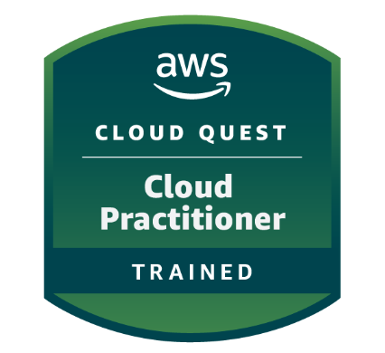

### AWS Training & Certification Overview

This document outlines the AWS certifications and training programs I have completed.  
Each section explains what the certification entailed and the practical skills I gained through hands-on learning and simulations.

These certifications form the foundation of my cloud knowledge and demonstrate my readiness for entry-level cloud and technical roles.

---

## AWS Cloud Quest: Cloud Practitioner (Trained)

### Overview
AWS Cloud Quest: Cloud Practitioner is a role-based, gamified learning experience designed to teach core AWS Cloud concepts through interactive challenges and real-world scenarios.

I completed hands-on quests that simulated real cloud tasks rather than just theoretical learning. This program reinforced AWS fundamentals in a practical, applied way.

### What This Certification Entailed
- Completing interactive cloud challenges in a simulated AWS environment
- Solving real-world scenarios related to cloud infrastructure
- Applying AWS best practices for cost, security, and reliability
- Reinforcing concepts required for the AWS Certified Cloud Practitioner exam

### Skills I Gained
- Understanding of core AWS services (EC2, S3, RDS, IAM, VPC)
- Ability to identify appropriate AWS services for common use cases
- Foundational cloud architecture and pricing models
- Practical exposure to cloud problem-solving and decision-making

---

## Introduction to AWS Identity and Access Management (IAM)

### Overview
This course focused on AWS Identity and Access Management (IAM), which is the foundation of security and access control in AWS environments.

### What This Certification Entailed
- Understanding how AWS controls access to resources
- Learning how identities and permissions are managed
- Exploring authentication vs authorization in AWS
- Reviewing security best practices using IAM

### Skills I Gained
- Creating and managing IAM users, groups, and roles
- Applying the principle of least privilege
- Understanding IAM policies and permission boundaries
- Securing AWS environments through proper access control

---

## AWS SimuLearn: Core Security Concepts

### Overview
This simulation-based course introduced AWS security concepts through practical, scenario-driven learning.

### What This Certification Entailed
- Working through simulated security incidents
- Learning how AWS secures infrastructure at multiple layers
- Understanding shared responsibility between AWS and the customer

### Skills I Gained
- Understanding the AWS Shared Responsibility Model
- Implementing basic security controls
- Identifying security risks and mitigation strategies
- Applying encryption, monitoring, and compliance principles

---

## AWS SimuLearn: Networking Concepts

### Overview
This course focused on networking fundamentals within AWS and how cloud networking differs from traditional on-premises networking.

### What This Certification Entailed
- Simulated configuration of AWS networking components
- Learning how data flows within and outside AWS environments
- Understanding connectivity and isolation in the cloud

### Skills I Gained
- Understanding Amazon VPC, subnets, route tables, and gateways
- Knowledge of public vs private networking
- Basic understanding of security groups and network ACLs
- Ability to design simple, secure cloud networks

---

## AWS SimuLearn: Databases in Practice

### Overview
This course explored database services in AWS and how to choose the right database solution based on workload requirements.

### What This Certification Entailed
- Working through database-related simulations
- Comparing different AWS database services
- Understanding performance, scalability, and availability needs

### Skills I Gained
- Differentiating between relational and non-relational databases
- Understanding use cases for Amazon RDS, DynamoDB, and Aurora
- Basic database scalability and high availability concepts
- Making informed database service selections

---

## AWS SimuLearn: File Systems in the Cloud

### Overview
This course focused on cloud storage and file systems, highlighting how AWS storage solutions support scalability, durability, and performance.

### What This Certification Entailed
- Learning different storage types and access patterns
- Understanding how file systems operate in cloud environments
- Exploring real-world storage scenarios

### Skills I Gained
- Understanding Amazon S3, EBS, and EFS use cases
- Choosing appropriate storage solutions based on workload needs
- Knowledge of durability, availability, and performance trade-offs
- Applying storage best practices in cloud architectures

---

## Summary of Skills Developed

Through these certifications, I developed a strong foundation in:

- AWS core services and cloud concepts
- Security and identity management
- Networking fundamentals
- Cloud storage and databases
- Practical, hands-on problem solving in AWS environments

These certifications demonstrate my commitment to building real-world cloud skills and preparing for a career in cloud computing and IT.

---

