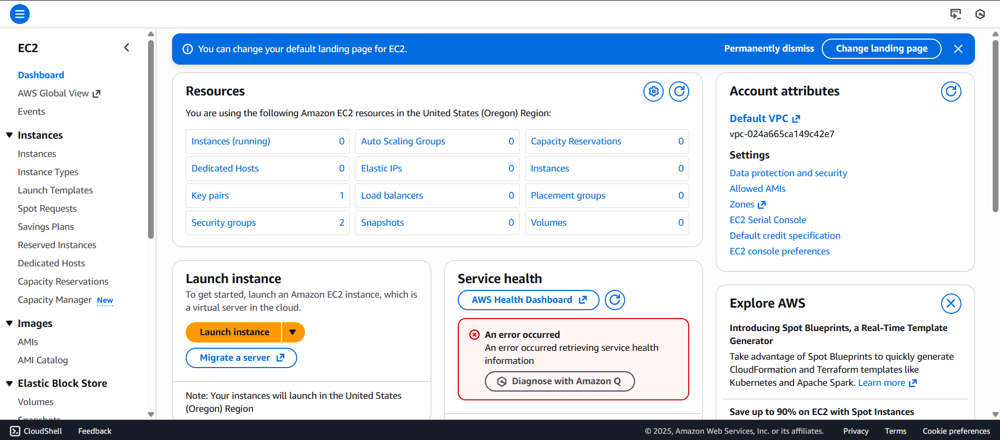
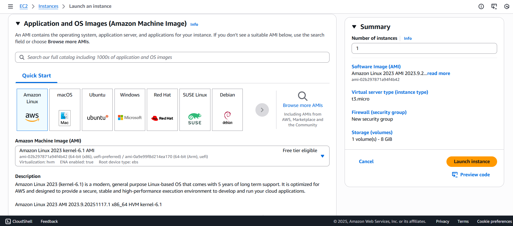
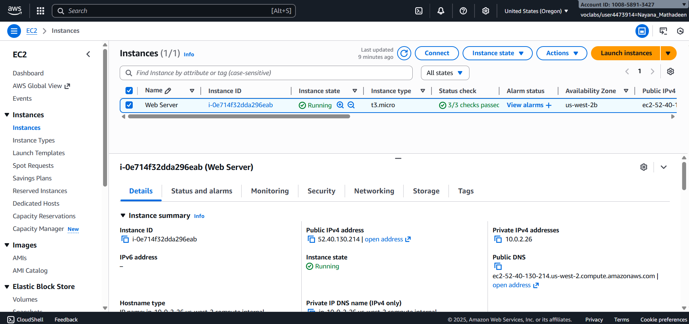

  Lauching an EC2 with Amazon EC2 – Step-by-Step Guide 
 
 ---
 
 ## 1. Open the EC2 Service
 
 1. In the AWS Management Console, at the top, choose **Services**.
 2. Under the **Compute** section (or use the search bar), choose **EC2**.
 3. Make sure you are on the **EC2 Dashboard** page.
 
 Why this step matters:
 - EC2 is the AWS service that lets you create **virtual servers** in the cloud.
 - The EC2 Dashboard is your “home base” to create, view, and manage these servers (called instances).
 
 
 
 
 ---
 
 ## 2. Task 1 – Launching Your EC2 Instance
 
 You are going to **create a virtual server** (an EC2 instance) and configure it to run a simple web page.
 
 On the EC2 Dashboard:
 
 1. Click **Launch instance**.
 2. Then click **Launch instance** again (if there’s a second button).
 
 
 
 
 ---
 
 ### 2.1 Name the Instance
 
 In the **Name and tags** section:
 
 1. In the `Name` box, type: `Web Server`.
 
 Why this step matters:
 - The `Name` is just a **label**, but it becomes very helpful when you have many instances.
 - AWS stores this as a **tag** with key `Name` and value `Web Server`.
 
 
 
 
 ---
 
 ### 2.2 Choose the Amazon Machine Image (AMI)
 
 Look for the **Application and OS Images (Amazon Machine Image)** section:
 
 1. You should see **Amazon Linux 2023** selected by default.
 2. Leave it as is.
 
 Why this step matters:
 - An **AMI** is like a template for your server. It defines:
   - The operating system (here: Amazon Linux)
   - Pre-installed software
   - Basic configuration
 - Choosing Amazon Linux 2023 means you get a modern, AWS-optimized Linux system.
 
 
 
 
 ---
 
 ### 2.3 Choose the Instance Type
 
 In the **Instance type** section:
 
 1. Open the dropdown list.
 2. Select `t3.micro`.
 
 Why this step matters:
 - The **instance type** defines:
   - How many virtual CPUs (vCPUs) you get
   - How much memory (RAM)
 - `t3.micro` is:
   - Small and cost-effective
   - Enough for a simple web server in this lab
 
 
 
 
 ---
 
 ### 2.4 Key Pair (Login)
 
 In the **Key pair (login)** section:
 
 1. Select **Proceed without a key pair (Not recommended)**.
 
 Why this step matters:
 - Normally, you use a **key pair** to securely log in to your EC2 instance using SSH.
 - In this lab, you **don’t need to log in** to the server directly.
 - That’s why we can skip creating or using a key pair.
 
 
 
 
 
 ---
 
 ### 2.5 Configure Network Settings
 
 In the **Network settings** section:
 
 1. Click **Edit**.
 2. For **VPC – required**, choose `Lab VPC`.
 3. Set **Security group name** to: `Web Server security group`.
 4. Set **Description** to: `Security group for my web server`.
 5. Remove any existing inbound rule (for example, SSH).
 
 Why this step matters:
 - The **VPC (Virtual Private Cloud)** is your isolated network in AWS.
 - The **Security Group** acts like a **firewall** for your instance.
 - Removing SSH means:
   - Nobody can log into the server directly.
   - This improves security, since for this lab, we only need web (HTTP) access later.
 
 
 
 
 ---
 
 ### 2.6 Storage Settings
 
 In the **Configure storage** section:
 
 1. Leave the default `8 GiB` EBS volume.
 
 Why this step matters:
 - This is your server’s **root disk** (boot drive).
 - 8 GiB is enough for:
   - The OS
   - A simple web server
 - You will learn later how to **resize** this disk.
 
 
 
 
 ---
 
 ### 2.7 Advanced Details – Enable Termination Protection and Add User Data
 
 Scroll down to **Advanced details**:
 
 1. Find **Termination protection**.
 2. Select **Enable**.
 
 Why this step matters:
 - **Termination protection** stops the instance from being accidentally deleted.
 - This is important in real environments to avoid losing servers unintentionally.
 
 Still in **Advanced details**, find the **User data** box and paste this script:
 
     #!/bin/bash
     yum -y install httpd
     systemctl enable httpd
     systemctl start httpd
     echo '<html><h1>Hello From Your Web Server!</h1></html>' > /var/www/html/index.html
 
 What this script does:
 - `yum -y install httpd`  
   Installs the Apache web server.
 - `systemctl enable httpd`  
   Configures Apache to start automatically when the server boots.
 - `systemctl start httpd`  
   Starts the web server right now.
 - `echo '<html><h1>Hello From Your Web Server!</h1></html>' > /var/www/html/index.html`  
   Creates a simple web page that shows the message:
 
   Hello From Your Web Server!
 
 Why this step matters:
 - **User data** lets you automatically configure the server when it first starts.
 - It saves time: no need to manually SSH into the instance to install software.
 
 
 

 

 ---
 
 ### 2.8 Launch the Instance
 
 On the right-hand side or at the bottom:
 
 1. Review your settings.
 2. Click **Launch instance**.
 3. Then click **View all instances**.
 
 You’ll see your instance in the list, starting in `Pending` state, then changing to `Running`.
 
 Wait until:
 - **Instance state**: `Running`
 - **Status checks**: `2/2 checks passed`
 
 Why this step matters:
 - `Running` means the virtual machine is up.
 - `2/2 checks passed` means AWS has verified the basic health of the instance and its underlying system.
 
 
 
 
 ---
 
 ## 3. Task 2 – Monitor Your Instance
 
 Select your instance by checking the box next to `Web Server`.
 
 ### 3.1 Status Checks
 
 1. At the bottom, choose the **Status checks** tab.
 2. You will see:
    - **System reachability**
    - **Instance reachability**
 3. Both should be **passed**.
 
 Why this step matters:
 - These checks help you quickly see if problems are:
   - With AWS infrastructure (system)
   - Or with your actual instance (software/OS)
 
 
 
 
 ---
 
 ### 3.2 Monitoring Tab
 
 1. Click the **Monitoring** tab.
 2. Here, you see **CloudWatch metrics** such as CPU usage, network traffic, etc.
 3. You can click any graph to see a larger view.
 
 Why this step matters:
 - Monitoring helps you:
   - Detect performance issues
   - See how busy your instance is
   - Decide if you need to scale up or down
 
 ---
 
 ### 3.3 Get Instance Screenshot
 
 1. From the **Actions** menu, choose `Monitor and troubleshoot` → `Get instance screenshot`.
 2. AWS shows you an image of what the instance console screen looks like.
 
 Why this step matters:
 - If you can’t connect via SSH or RDP, the screenshot shows:
   - Whether the OS is stuck booting
   - Any error messages on the console
 - This helps with **troubleshooting**.
 
 ---
 
 ## 4. Task 3 – Update Security Group and Access the Web Server
 
 Now you’ll try to open the web page that your script created.
 
 ### 4.1 Get the Public IP
 
 1. Select the `Web Server` instance.
 2. In the **Details** tab, copy the **Public IPv4 address**.
 
 3. Open a new browser tab, paste the IP address, and press **Enter**.
 
 Question: Can you see the web page?
 
 At this point: **No, you can’t.**
 
 Why not?
 - Because the Security Group doesn’t yet allow **HTTP (port 80)** traffic.
 - This shows how the Security Group acts like a **firewall**, blocking unwanted network traffic.
 
 ---
 
 ### 4.2 Modify Security Group to Allow HTTP
 
 1. In the left menu, click **Security Groups** under **Network & Security**.
 2. Select the Security Group called `Web Server security group`.
 3. Go to the **Inbound rules** tab.
 4. Click **Edit inbound rules** → **Add rule**.
 5. Set:
    - **Type:** `HTTP`
    - **Port:** (auto-filled as 80)
    - **Source:** `Anywhere-IPv4`
 6. Click **Save rules**.
 
 Why this step matters:
 - You are explicitly allowing **web traffic** from the internet to reach your server on **port 80**.
 - This is required for browsers to load your web page.
 
 _Image placeholder:_
 
 
 
 ---
 
 ### 4.3 Refresh the Web Page
 
 1. Go back to the browser tab with the public IP.
 2. Refresh the page.
 
 You should now see:
 
 `Hello From Your Web Server!`
 
 Why this step matters:
 - This confirms:
   - The EC2 instance is running.
   - Apache is installed and serving your page.
   - The Security Group now allows necessary traffic.
 
 ---
 
 ## 5. Task 4 – Resize the Instance and EBS Volume
 
 Sometimes your instance is too small or too big for your needs. In this task, you’ll change:
 
 - The **instance type** (more memory)
 - The **disk size** (more storage)
 
 ---
 
 ### 5.1 Stop the Instance
 
 1. In the left menu, click **Instances**.
 2. Select your `Web Server` instance.
 3. Click **Instance state** → **Stop instance**.
 4. Confirm by clicking **Stop**.
 
 Why this step matters:
 - For many changes (like instance type), the instance must be **stopped**.
 - When stopped:
   - You don’t pay for compute time
   - But you still pay for the EBS storage
 
 ---
 
 ### 5.2 Change the Instance Type
 
 1. With the instance **stopped**, go to **Actions**.
 2. Choose `Instance settings` → `Change instance type`.
 3. Set **Instance type** to: `t3.small`.
 4. Click **Change instance type**.
 
 Why this step matters:
 - `t3.small` has more memory than `t3.micro`.
 - This simulates scaling up your server for a heavier workload.
 
 
 
 ---
 
 ### 5.3 Resize the EBS Volume
 
 1. In the left menu, click **Volumes** under **Elastic Block Store**.
 2. Select the volume attached to your instance (usually 8 GiB).
 3. Click **Actions** → **Modify Volume**.
 4. Change the size from `8` to `10` (GiB).
 5. Click **Modify**, then confirm.
 
 Why this step matters:
 - Your root disk now has more space.
 - This is useful when you need more storage for logs, software, or data.
 
 
 
 ---
 
 ### 5.4 Start the Instance Again
 
 1. Go back to **Instances**.
 2. Select `Web Server`.
 3. Click **Instance state** → **Start instance**.
 
 Your instance is now:
 - Type: `t3.small`
 - Root volume: `10 GiB`
 
 Why this step matters:
 - You’ve successfully **scaled up** your server’s compute resources and storage without creating a new instance.
 
 
 
 ---
 
 ## 6. Task 5 – Test Termination Protection
 
 Now you’ll see how **termination protection** works.
 
 ### 6.1 Try to Terminate the Instance (With Protection Enabled)
 
 1. Make sure the `Web Server` instance is selected.
 2. Click **Instance state** → **Terminate instance**.
 3. Confirm.
 
 You should see an **error message** saying that the instance cannot be terminated.
 
 Why this happens:
 - Termination protection is **enabled**.
 - AWS blocks termination to protect you from deleting important servers by mistake.
 
 
 
 ---
 
 ### 6.2 Disable Termination Protection
 
 1. With `Web Server` still selected, go to **Actions**.
 2. Choose `Instance settings` → `Change termination protection`.
 3. Uncheck `Enable`.
 4. Click **Save**.
 
 Why this step matters:
 - You are manually allowing this instance to be terminated.
 - In production environments, you only disable this when you are absolutely sure you want to delete the instance.
 
 
 
 ---
 
 ### 6.3 Terminate the Instance
 
 1. Once again, click **Instance state** → **Terminate instance**.
 2. Confirm by clicking **Terminate**.
 
 Now the instance will:
 - Go to `shutting-down`
 - Then to `terminated`
 
 Why this step matters:
 - You’ve fully cleaned up the resources.
 - In real environments, this step is important to **stop paying** for unnecessary instances.
 
 
 
 
 ---
 
 ## * What was Learned in This Lab *
 
 By following these steps, I learned how to:
 
 - Launch an EC2 instance with a custom name and configuration.
 - Understand what AMIs, instance types, VPCs, and Security Groups are.
 - Use user data to automatically install and configure software (a web server).
 - Monitor instance health and performance.
 - Open the correct ports (HTTP) to reach your web application.
 - Resize instance type and disk size to scale resources.
 - Use termination protection to avoid accidental deletion.
 - Properly terminate an instance and end a lab environment.
 
 This is the **foundation** of working with virtual servers in the cloud.