# Lab Guide: Introduction to Amazon Aurora

## Lab Overview
In this lab, you will create an Amazon Aurora database, connect to it from an Amazon EC2 Linux instance, configure database connectivity, and perform basic SQL operations such as creating tables, inserting data, and querying records.

---

## Objectives
By completing this lab, you will be able to:
- Create an Amazon Aurora database instance
- Connect to an Amazon EC2 Linux instance
- Configure EC2 to connect to Aurora
- Create tables and insert records
- Query data using SQL

---

## Task 1: Create an Aurora Database Instance

1. Open the AWS Management Console.
2. Search for and select **RDS**.
3. Choose **Databases → Create database**.
4. Configure the database:
   - Creation method: **Standard create**
   - Engine type: **Aurora (MySQL Compatible)**

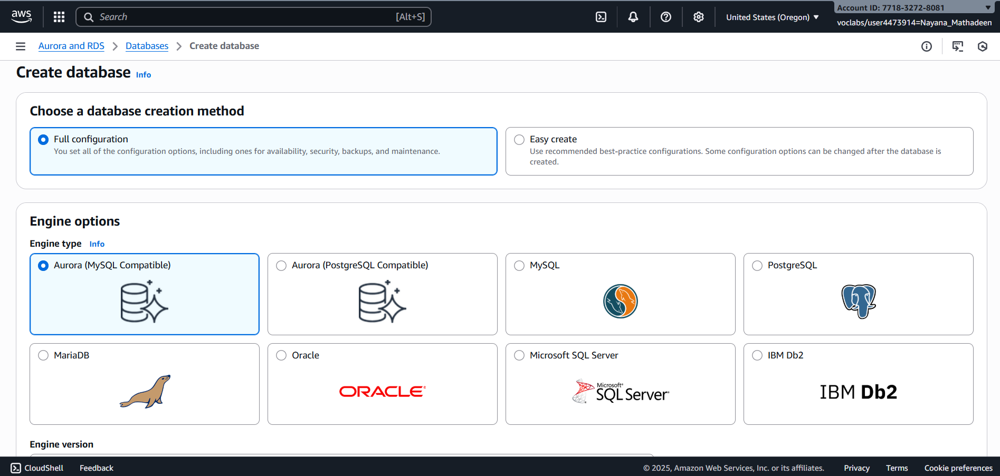

   - Engine version: **MySQL 8.0 (default)**
   - Template: **Dev/Test**

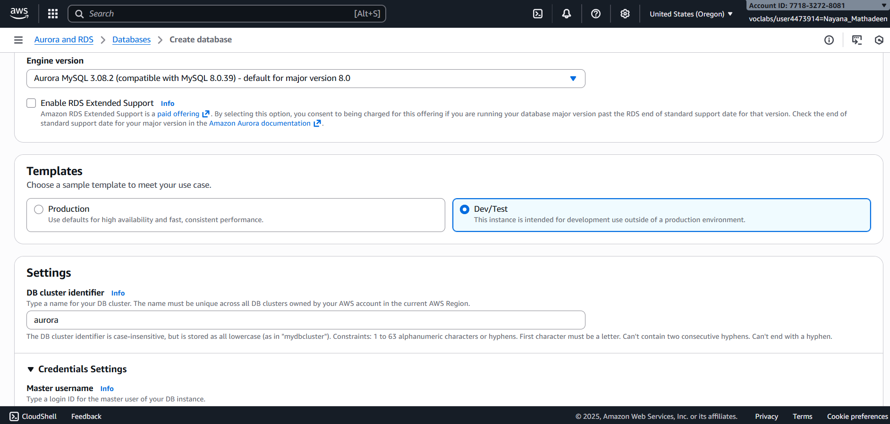

5. Set credentials:
   - DB cluster identifier: `aurora`
   - Master username: `admin`
   - Master password: `admin123`

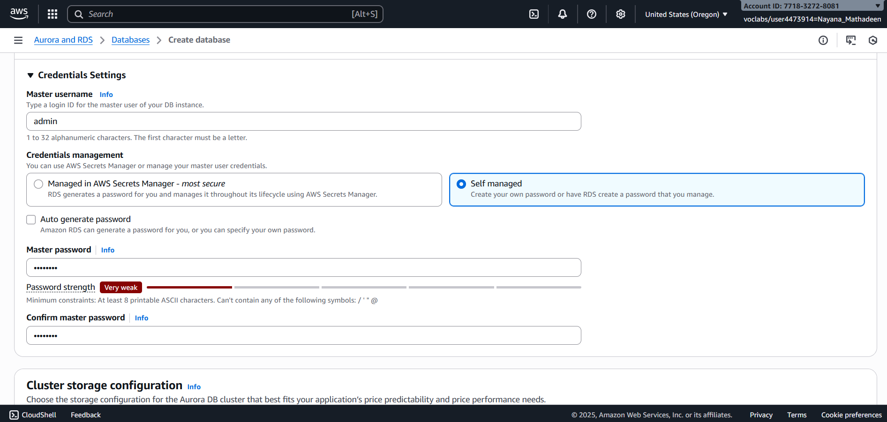

6. Choose instance class:
   - Burstable class: `db.t3.medium`

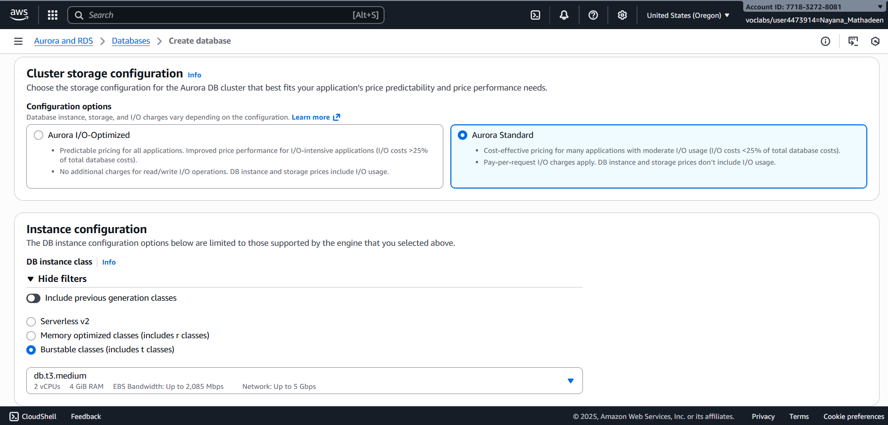

7. Configure connectivity:
   - VPC: **LabVPC**

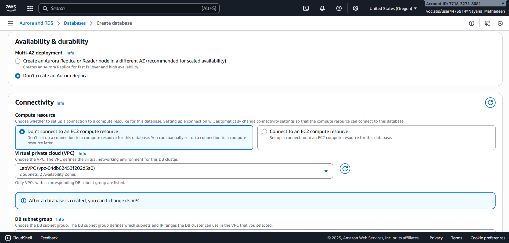

   - Subnet group: **dbsubnetgroup**
   - Public access: **No**
   - Security group: **DBSecurityGroup**

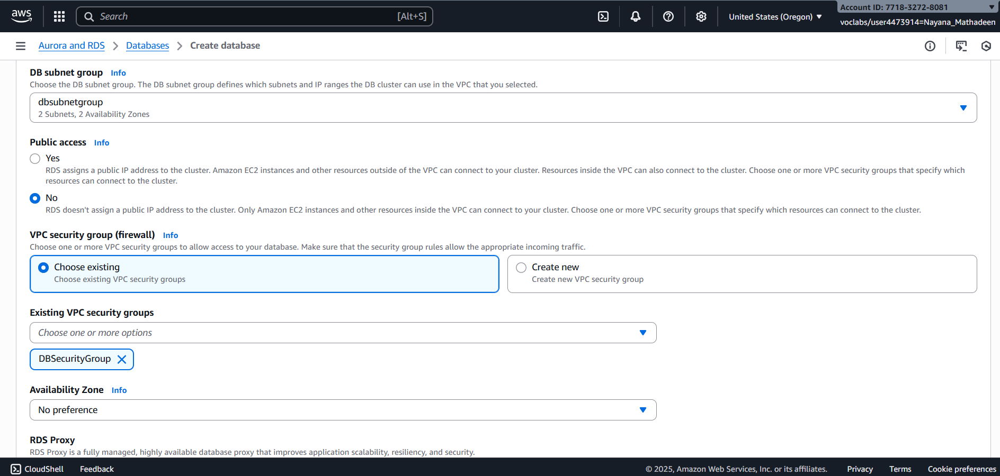

8. Additional settings:
   - Initial database name: `world`

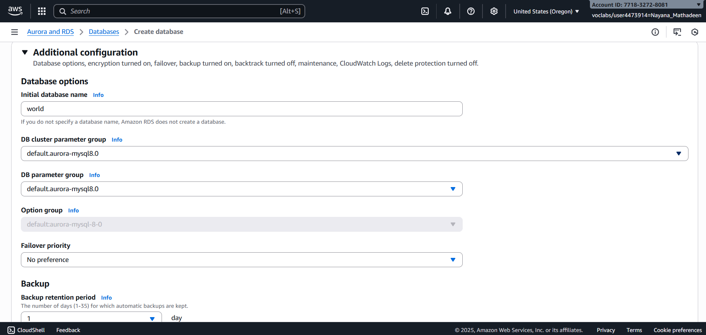

   - Disable encryption

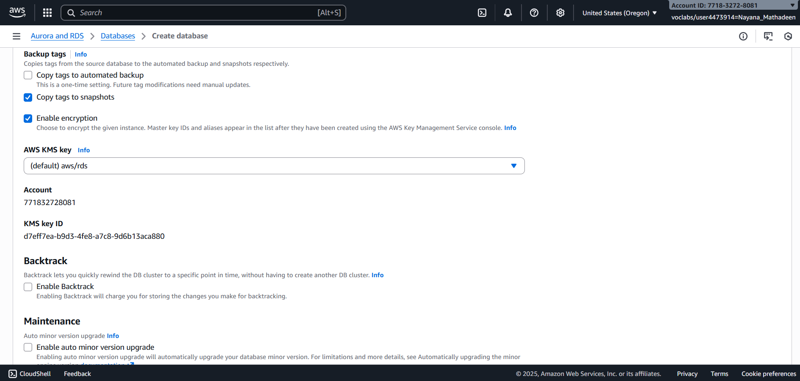

   - Disable enhanced monitoring

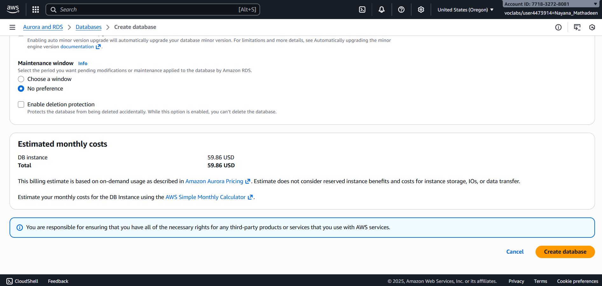

9. Choose **Create database**.

**Expected Result:**  
Aurora database is created successfully.

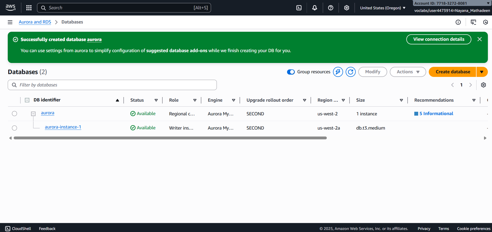

---

## Task 2: Connect to the Amazon EC2 Linux Instance

1. Navigate to **EC2 → Instances**.
2. Select the instance named **Command Host**.
3. Choose **Connect → Session Manager → Connect**.

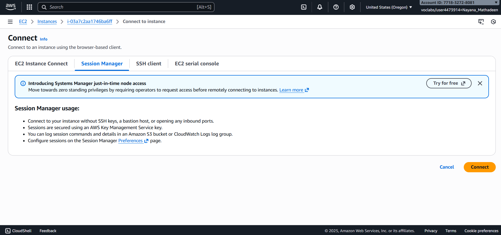

**Expected Result:**  
A terminal session opens to the EC2 instance.

---

## Task 3: Configure EC2 to Connect to Aurora

1. Install the MariaDB client:
   ```bash
   sudo yum install mariadb -y
2. Open the **RDS → Databases** page.
3. Select the **aurora** database.
4. Copy the **Writer (cluster) endpoint**.

Connect to the database:
mysql -u admin --password='admin123' -h <aurora-endpoint>

Expected Result:  
You are connected to the MariaDB/MySQL prompt.

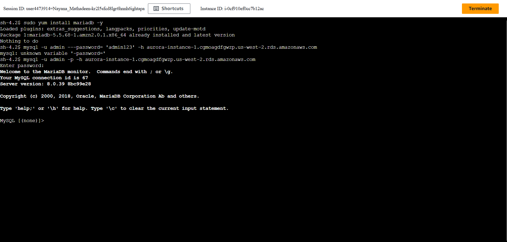
---

## Task 4: Create Tables and Query Records

1. List databases: SHOW DATABASES;

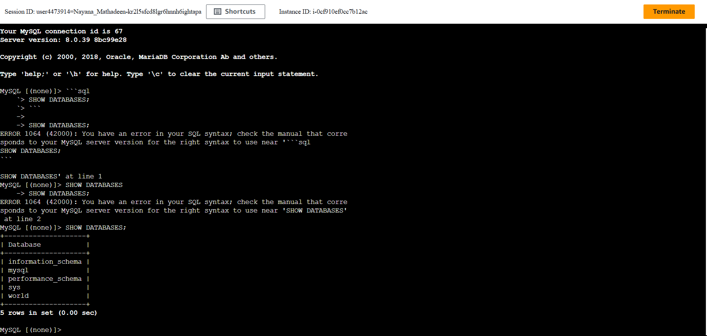

2. Select the `world` database: USE world;

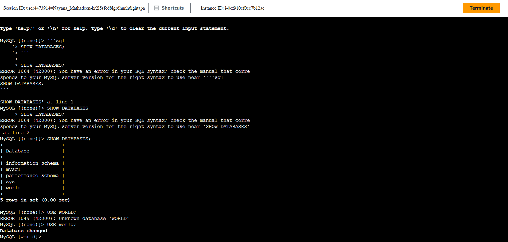

3. Create the `country` table: CREATE TABLE country (...);


5. Insert records into the table.

5. Run a query:
SELECT * FROM country
WHERE GNP > 35000 AND Population > 10000000;

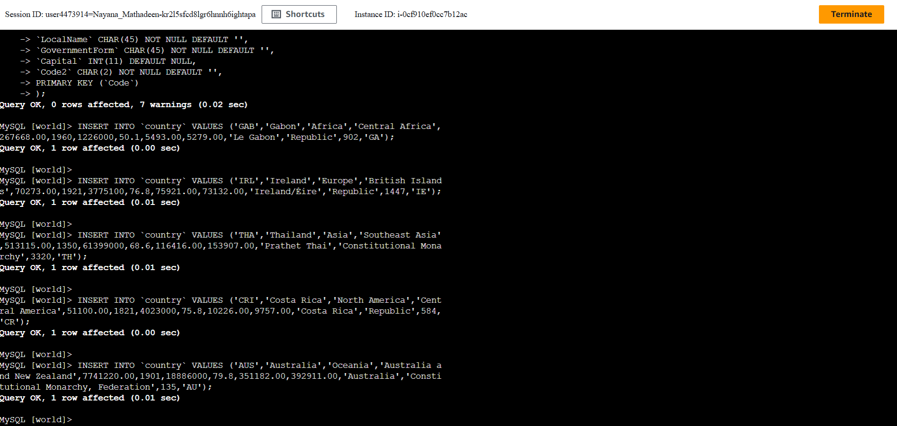

Expected Result:  
Two records (Australia and Thailand) are returned.

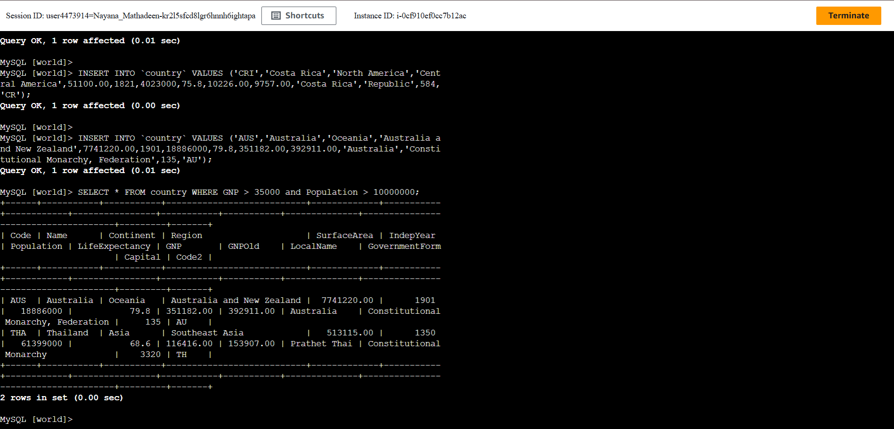

---

### * What was Learned In this Lab *

By following these steps, I learned how to:

- Create an Amazon Aurora database using Amazon RDS.
- Understand how Aurora integrates with Amazon EC2 within a VPC.
- Connect securely to a relational database from a Linux EC2 instance.
- Install and use the MariaDB/MySQL client on Amazon Linux.
- Use database endpoints to manage read and write connections.
- Create relational tables using SQL.
- Insert records and query data using SQL statements.
- Manage and clean up database resources in a lab environment.

This lab forms a strong foundation for working with managed relational databases and backend data services in the AWS cloud.
