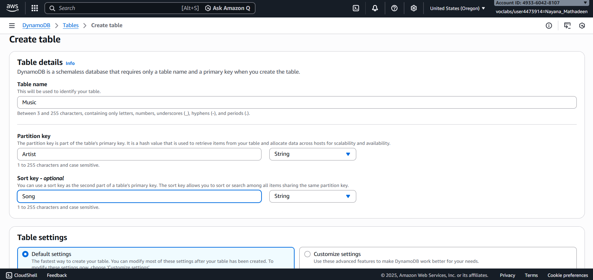
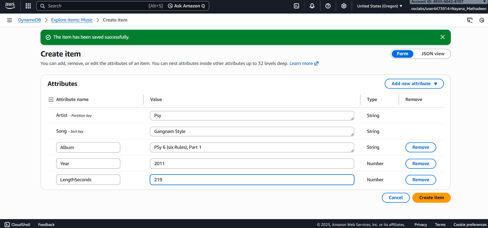
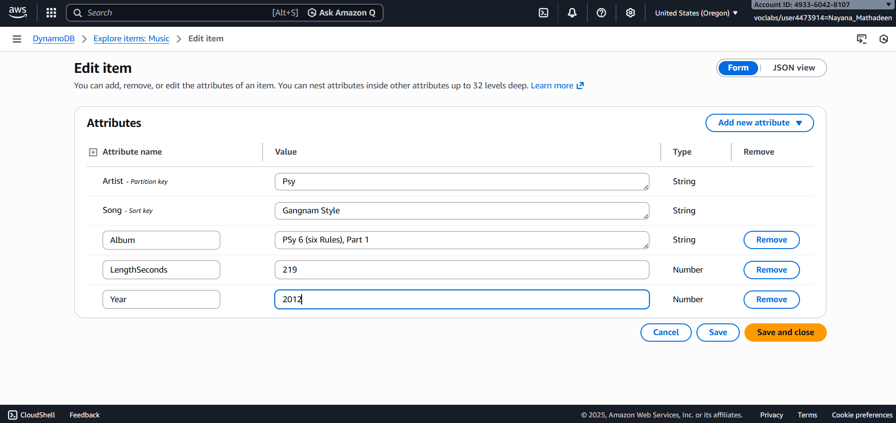
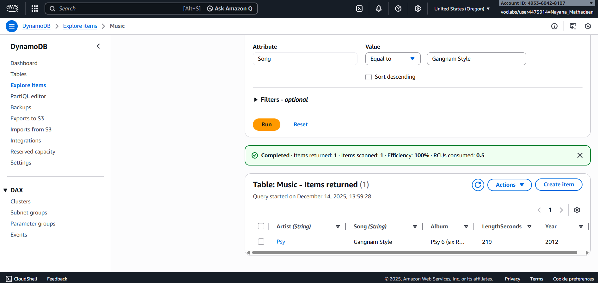
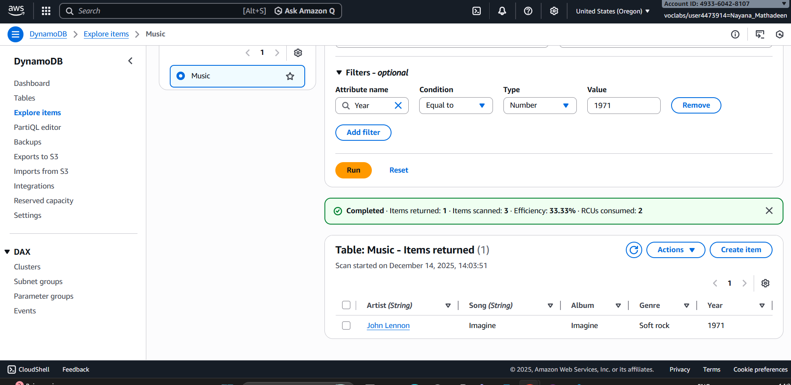
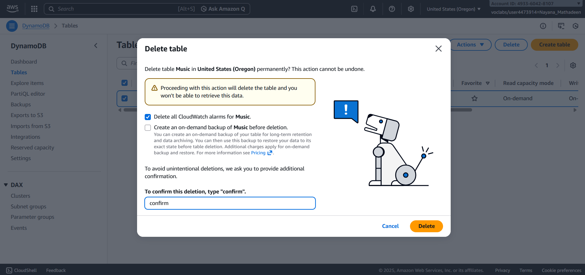
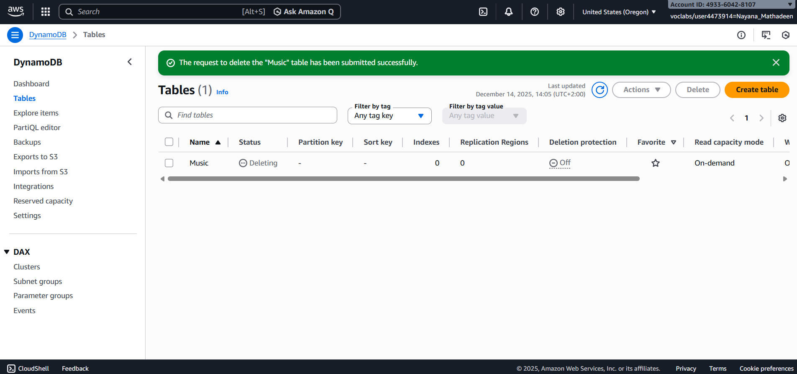

# Lab Guide: Introduction to Amazon DynamoDB

## Lab Overview
In this lab, you will work with Amazon DynamoDB, a fully managed NoSQL database service. You will create a DynamoDB table, add and modify items, retrieve data using query and scan operations, and delete the table once complete.

This lab demonstrates DynamoDB’s flexible schema design and efficient data access patterns using partition and sort keys.

---

## Objectives
By the end of this lab, you will be able to:
- Create an Amazon DynamoDB table
- Insert items with flexible attributes
- Modify existing data in a DynamoDB table
- Retrieve data using query and scan operations
- Delete a DynamoDB table and clean up resources

---

## Task 1: Create a DynamoDB Table

1. From the AWS Management Console, open **Services**.
2. Under **Database**, choose **DynamoDB**.
3. Choose **Create table**.
4. Configure the table:
   - **Table name:** Music
   - **Partition key:** Artist (String)
   - **Sort key:** Song (String)
5. Leave all other settings as default.
6. Choose **Create table**.
7. Wait until the table status changes to **Active**.

**Expected Result:**  
The **Music** table is successfully created and active.

---

## Task 2: Add Items to the Table

### Create the First Item
1. Select the **Music** table.
2. Choose **Actions → Create item**.
3. Enter the following attributes:
   - Artist (String): Pink Floyd
   - Song (String): Money
   - Album (String): The Dark Side of the Moon
   - Year (Number): 1973
4. Choose **Create item**.

---

### Create the Second Item
Add another item with the following attributes:
- Artist (String): John Lennon
- Song (String): Imagine
- Album (String): Imagine
- Year (Number): 1971
- Genre (String): Soft rock

Choose **Create item**.

---

### Create the Third Item
Add a third item with the following attributes:
- Artist (String): Psy
- Song (String): Gangnam Style
- Album (String): Psy 6 (Six Rules), Part 1
- Year (Number): 2011
- LengthSeconds (Number): 219

Choose **Create item**.

**Expected Result:**  
Three items with different attributes are stored in the DynamoDB table.

---

## Task 3: Modify an Existing Item

1. In the DynamoDB console, choose **Explore items**.
2. Select the **Music** table.
3. Choose the item with:
   - Artist: Psy
4. Edit the **Year** attribute:
   - Change from `2011` to `2012`
5. Choose **Save changes**.

**Expected Result:**  
The selected item is updated successfully.

---

## Task 4: Query the Table

1. Expand **Scan/Query items**.
2. Select **Query**.
3. Enter the following:
   - Artist (Partition key): Psy
   - Song (Sort key): Gangnam Style
4. Choose **Run**.

**Expected Result:**  
The matching item is returned immediately.

---

## Task 5: Scan the Table

1. Switch from **Query** to **Scan**.
2. Expand **Filters**.
3. Enter the following filter:
   - Attribute name: Year
   - Type: Number
   - Value: 1971
4. Choose **Run**.

**Expected Result:**  
Only the song released in 1971 is displayed.

---

## Task 6: Delete the DynamoDB Table

1. In the DynamoDB dashboard, select the **Music** table.
2. Choose **Actions → Delete table**.
3. When prompted, type `delete` to confirm.
4. Choose **Delete table**.

**Expected Result:**  
The DynamoDB table and all stored data are permanently removed.

---

### ** * What Was Learned In This Lab * **

By following these steps, I learned how to:

- Create an Amazon DynamoDB table using a partition key and sort key.
- Understand how DynamoDB uses key-value and document data models.
- Add items with flexible attributes without defining a fixed schema.
- Modify existing items stored in a DynamoDB table.
- Retrieve data efficiently using query operations.
- Use scan operations with filters to search across all table items.
- Understand the performance difference between queries and scans.
- Safely delete a DynamoDB table and clean up AWS resources.

This lab provides a strong foundation for working with NoSQL databases and building scalable, high-performance applications on AWS.
