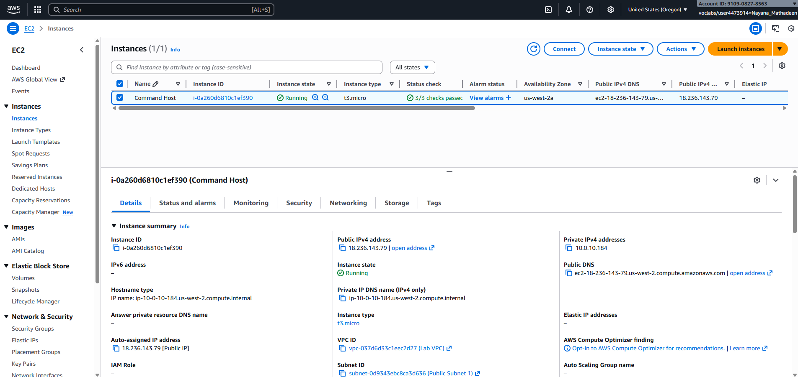
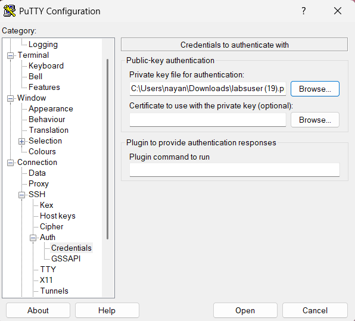
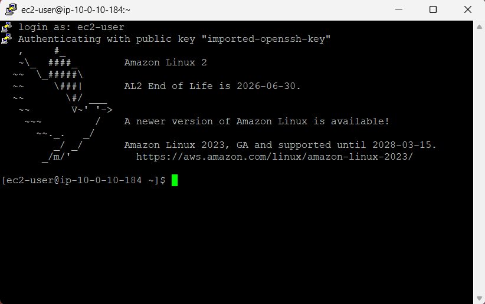

# Amazon Linux AMI Lab Guide  
Accessing Linux via SSH and Exploring Man Pages

This lab teaches you how to securely connect to an Amazon Linux EC2 instance using SSH key authentication. Once connected, you will explore the Linux command help system using manual pages (man). The goal is to build foundational Linux confidence by navigating the terminal and learning how to read command documentation.

---

AWS Service Limitations  
You are working inside a controlled training environment. Only the services required to complete the lab are enabled. Attempts to use non-lab resources may result in access errors.

------------------------------------------------------------

Scenario Overview  

In this lab, you will:  
• Retrieve connection credentials for an Amazon Linux EC2 instance  
• Connect to it using SSH  
• Use man pages to explore Linux command documentation

The environment already includes:  
• An EC2 instance running Amazon Linux  
• A public subnet  
• A VPC to host the instance  

------------------------------------------------------------

Learning Objectives  

By the end of this lab, you will be able to:  
✓ Connect to an Amazon Linux AMI via SSH  
✓ Understand how the man help system works  
✓ Navigate manual pages using standard controls  
✓ Interpret common documentation headers  

------------------------------------------------------------

Task 1: Connect to the Amazon Linux Instance via SSH  

SSH (Secure Shell) provides encrypted access to the EC2 instance. Authentication is done using a downloaded key file rather than a password.

------------------------------------------------------------
Windows Users (PuTTY Connection Steps)

1. Open Details panel  
2. Download labsuser.ppk  
3. Note Public IP address  
4. Install PuTTY if needed  
5. Configure PuTTY:
   Hostname:
     ec2-user@<public-ip>
   Load SSH Key:
     labsuser.ppk
6. Connect

Expected result: You should see a Linux shell prompt.

------------------------------------------------------------

Why These Steps Matter

• Key files (.pem/.ppk) provide secure identity verification  
• chmod prevents unauthorized access to private keys  
• ec2-user is the default Linux admin account  
• SSH is the standard secure method for accessing cloud-hosted Linux systems  

These practices mirror real cloud administration tasks.

------------------------------------------------------------

Task 2: Explore Linux Manual Pages (man)

Linux manual pages explain command purpose, syntax, flags, and examples.

To open the man page for the man command, run:

     man man

------------------------------------------------------------

Important Man Page Sections to Review  

• NAME — Quick summary of the command  
• SYNOPSIS — How to structure the command  
• DESCRIPTION — Full coverage of usage  
• OPTIONS — Available flags and modifiers  
• FILES — Directories used by the command  
• SEE ALSO — Related commands

------------------------------------------------------------

Why Man Pages Are Valuable

• Commands have built-in documentation  
• Eliminates the need to search online  
• Works even on isolated servers  
• Teaches correct usage and flags  
• Helps troubleshoot and learn new commands  

------------------------------------------------------------

Exit Man Pages

Press:
     q

This returns you to the command prompt.

------------------------------------------------------------

Key Concepts Learned

✓ SSH key-based authentication  
✓ Secure permissions with chmod  
✓ Using ec2-user on Amazon Linux  
✓ Accessing built-in Linux documentation  
✓ Navigating man pages  
✓ Reading command descriptions, syntax and parameters  

These skills apply directly to DevOps, Cloud Engineering, Security, and Linux-based operations.

------------------------------------------------------------

Architecture Diagram

   Local Computer
 (PuTTY or Terminal)
            |
            | SSH Connection
            | Key Authentication
            v
  Amazon Linux EC2 Instance
         (AMI Host)
            |
 In Lab VPC and Public Subnet

------------------------------------------------------------

Next Commands to Explore

     man ls  
     man chmod  
     man systemctl  

------------------------------------------------------------
