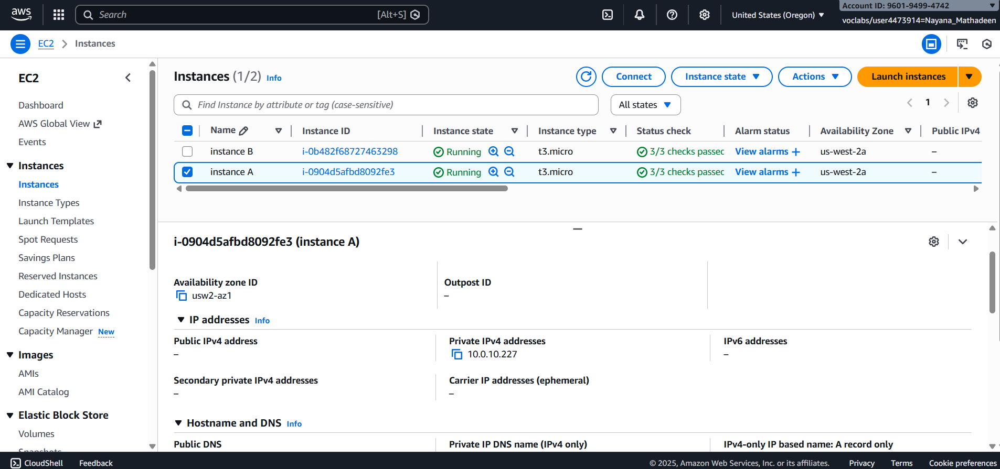
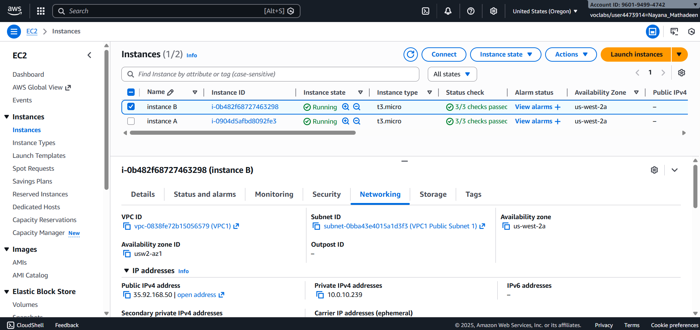
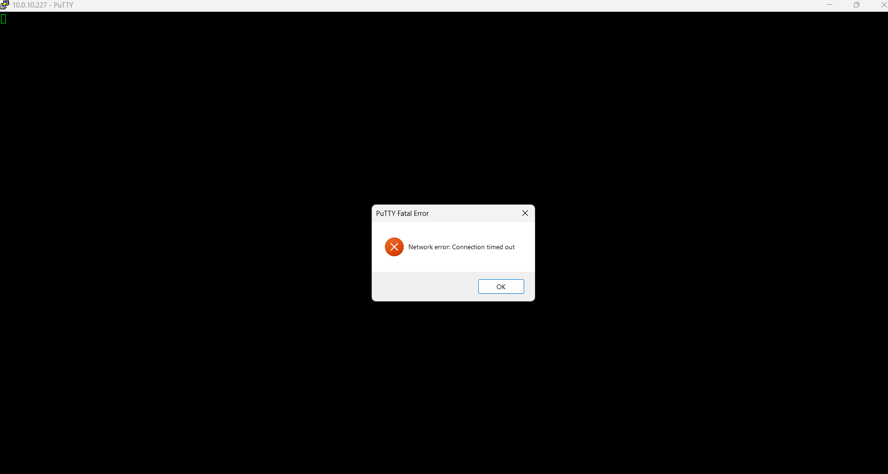

---
## LAB GUIDE Internet Protocols: Public and Private IP Addresses

## Lab Overview
In this lab, you will investigate a customer networking issue involving public and private IP addresses in AWS. You will analyze EC2 instance networking details, test SSH connectivity, and determine why one instance can reach the internet while another cannot.

---

## Objectives
By completing this lab, you will be able to:
- Identify public and private IP addresses on EC2 instances
- Understand how IP address types affect connectivity
- Troubleshoot EC2 networking issues
- Apply best practices for VPC CIDR selection
- Communicate findings as a cloud support engineer

---

## Task 1: Investigate the Customer Environment

1. Open the AWS Management Console.
2. Navigate to **EC2 → Instances**.
3. Identify **Instance A** and **Instance B**.
4. For each instance:
   - Select the instance
   - Open the **Networking** tab
   - Record the public and private IPv4 addresses
5. Compare the IP addressing of both instances.

**Expected Result:**  
Instance B has a public IP address, while Instance A does not.

---

## Task 2: Connect to EC2 Using SSH

## Windows Users

1. Download the `labsuser.ppk` file.
2. Open **PuTTY**.
3. Configure PuTTY to use the `.ppk` key file.
4. Attempt to connect using the **public IP address** of the instance.

---

## Expected Result

- SSH connection succeeds for **Instance B**

- SSH connection fails for **Instance A**

---

## Task 3: Analyze and Respond to the Customer

- Determine why **Instance A** cannot be reached from the internet.
- Explain that **private IP addresses are not accessible outside the VPC**.
- Address the customer’s question regarding using a **public CIDR range** for a VPC.
- Recommend using **private IP ranges** for VPC design.

## Task 3: Analyze and Respond to the Customer — Answer

**Why Instance A cannot reach the internet:**

Instance A cannot reach the internet because it has **only a private IP address** assigned to it. Private IP addresses are only routable within the VPC and cannot be accessed from or communicate directly with the public internet. Even though the VPC, subnet, route table, and internet gateway are configured correctly, the lack of a public IP prevents outbound and inbound internet connectivity.

Instance B is able to reach the internet because it has a **public IP address** associated with it, allowing traffic to be routed through the internet gateway.

---

**Response to the customer’s question about using a public CIDR range (e.g. 12.0.0.0/16) for a VPC:**

Using a public IP address range for a VPC is **not recommended**. Public IP ranges are owned and managed by internet authorities and may already be in use elsewhere on the internet. Using them inside a VPC can cause routing conflicts, connectivity issues, and security risks.

AWS best practice is to use **private IP ranges defined by RFC 1918**, such as:
- 10.0.0.0/8
- 172.16.0.0/12
- 192.168.0.0/16

These ranges are specifically reserved for private networks and avoid conflicts with public internet routing.

---

**Final Conclusion:**

The root cause of the issue is **IP addressing**, not the EC2 instance configuration or VPC architecture. Assigning a public IP to Instance A (or placing it behind a NAT gateway if outbound-only access is required) would resolve the connectivity issue.

---

### ** * What Was Learned in This Lab* **

By following these steps, I learned how to:

- Identify the difference between public and private IP addresses in AWS.
- Analyze EC2 instance networking configurations within a VPC.
- Understand why instances with only private IPs cannot be accessed from the internet.
- Use SSH to test connectivity to EC2 instances.
- Troubleshoot networking issues using a layered approach.
- Explain why private CIDR ranges are recommended for VPC design.
- Apply AWS networking best practices when advising customers.
- Communicate technical findings clearly in a cloud support scenario.

This lab forms a strong foundation for understanding AWS networking concepts, troubleshooting connectivity issues, and supporting customers in real-world cloud environments.
