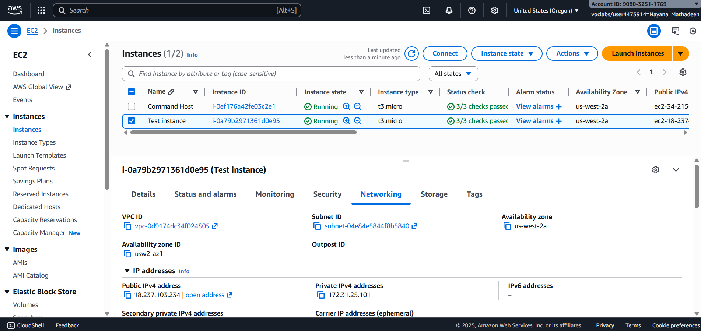
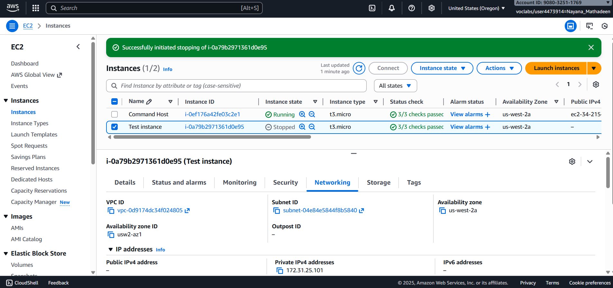
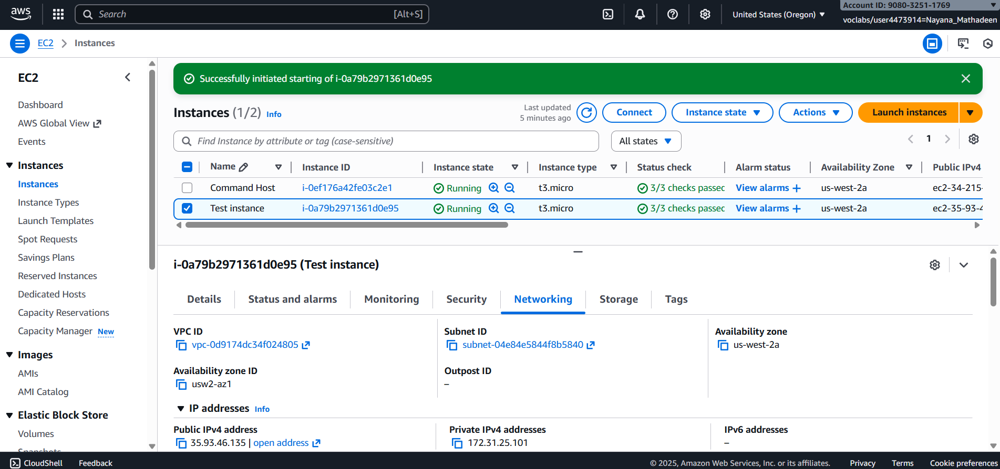
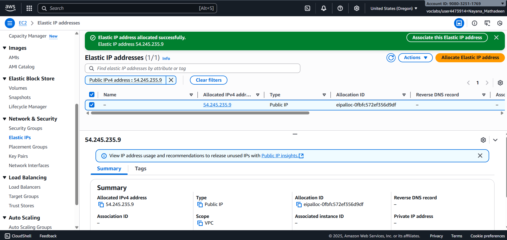
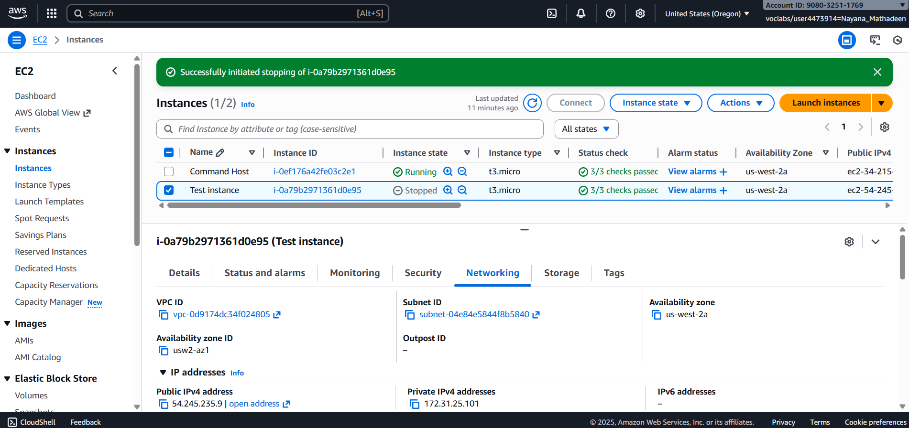

## Lab Guide: Internet Protocols – Static and Dynamic Addresses

## Lab Overview

In this lab, you will investigate a customer issue involving dynamically assigned public IP addresses on Amazon EC2. You will replicate the issue, analyze the behavior of public and private IP addresses, and implement a permanent solution using an Elastic IP.

---

## Objectives

By completing this lab, I was able to:
- Identify dynamic and static IP behavior on EC2 instances
- Understand why public IPs change when instances are stopped
- Assign a static public IP using Elastic IPs
- Troubleshoot customer networking issues
- Communicate findings as a cloud support engineer

---

## Task 1: Investigate the Customer Environment

1. Open the AWS Management Console.
2. Navigate to **EC2 → Instances**.
3. Launch a new EC2 instance using:
   - Amazon Linux 2 AMI
   - Instance type: `t3.micro`
   - Public subnet
   - Auto-assign public IP: **Enabled**
4. Name the instance `test instance`.
5. Wait for the instance state to show **Running (2/2)**.
6. Open the **Networking** tab and record:
   - Public IPv4 address
   - Private IPv4 address

7. Stop the instance and observe the IP addresses.

8. Start the instance again and compare the IP addresses.

**Expected Result:**  
The public IP address changes, while the private IP remains the same.

---

## Task 2: Assign a Static IP Using Elastic IP

1. In the EC2 console, navigate to **Network & Security → Elastic IPs**.
2. Choose **Allocate Elastic IP address**.
3. Keep default settings and select **Allocate**.
4. Select the newly created Elastic IP.
5. Choose **Actions → Associate Elastic IP address**.
6. Associate the EIP with:
   - Resource type: **Instance**
   - Instance: `test instance`
7. Confirm the association.

8. Stop and start the instance again.

9. Recheck the public IP address.

**Expected Result:**  
The public IP address remains the same after restart.

---

## Task 3: Send the Response to the Customer

1. Explain why the IP address was changing.
2. Identify the use of a dynamic public IP as the root cause.
3. Describe how Elastic IPs provide static public IP addresses.
4. Confirm that the issue is resolved.

**Expected Result:**  
A clear explanation and validated solution for the customer.

## Task 3: Response to the Customer

Hello Bob,

Thank you for reaching out regarding the issue with your EC2 instance’s IP address changing after stop and start operations.

After investigating the environment, we identified that the EC2 instance named **Public Instance** was using a **dynamically assigned public IP address**. By default, AWS assigns public IPs dynamically, and these IP addresses are released when an instance is stopped. As a result, a new public IP is assigned when the instance is started again, which explains why your IP address changes and causes dependent resources to break.

To resolve this issue, we implemented an **Elastic IP (EIP)**. An Elastic IP is a **static, persistent public IP address** that remains the same even when an EC2 instance is stopped and restarted. Once the Elastic IP was allocated and associated with your instance, the public IP no longer changed across restarts.

**Summary of the solution:**
- The issue was caused by the use of a dynamic public IP address.
- An Elastic IP was allocated and associated with the EC2 instance.
- The instance now retains the same public IP address after stop/start cycles.
- This resolves the connectivity and dependency issues you were experiencing.

Your issue has now been fully resolved. Please let us know if you have any further questions or if you would like assistance with additional AWS networking best practices.

Kind regards,  
Cloud Support Engineer  
Amazon Web Services

---

### What Was Learned in This Lab

By following these steps, I learned how to:

- Identify the difference between static and dynamic IP addresses in AWS.
- Understand why EC2 public IP addresses change when instances are stopped.
- Observe how private IP addresses remain consistent within a VPC.
- Allocate and manage Elastic IPs in AWS.
- Associate an Elastic IP with an EC2 instance.
- Verify persistent connectivity after instance restarts.
- Troubleshoot real-world customer networking issues.
- Communicate technical findings clearly as a cloud support engineer.

This lab forms a strong foundation for understanding IP address management and designing reliable, internet-facing cloud infrastructure on AWS.
