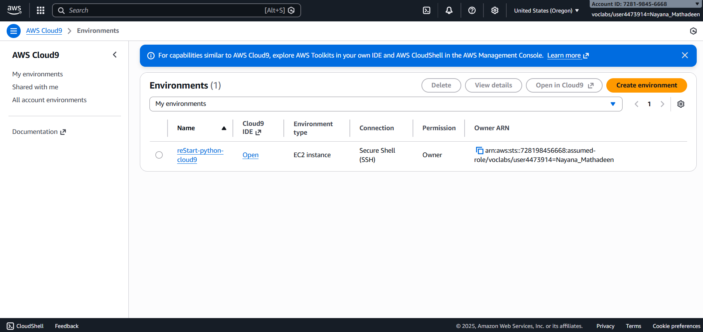
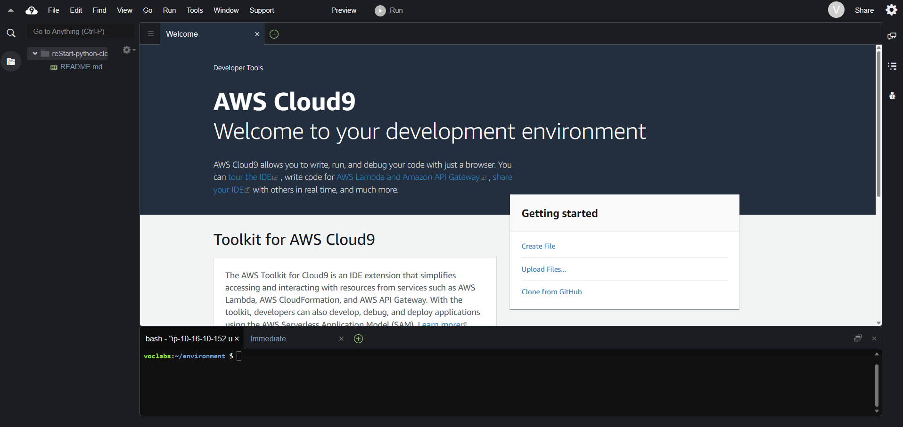
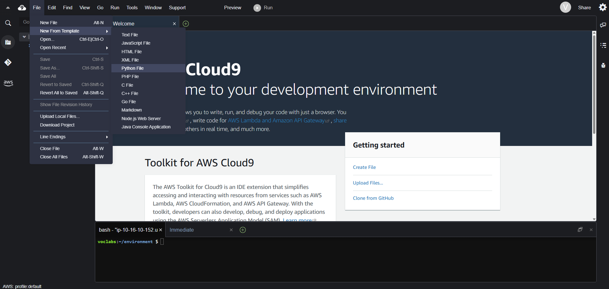
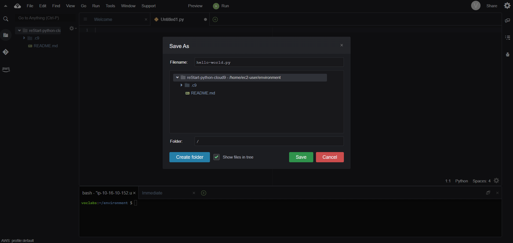
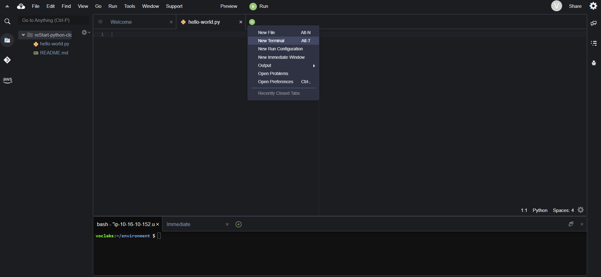
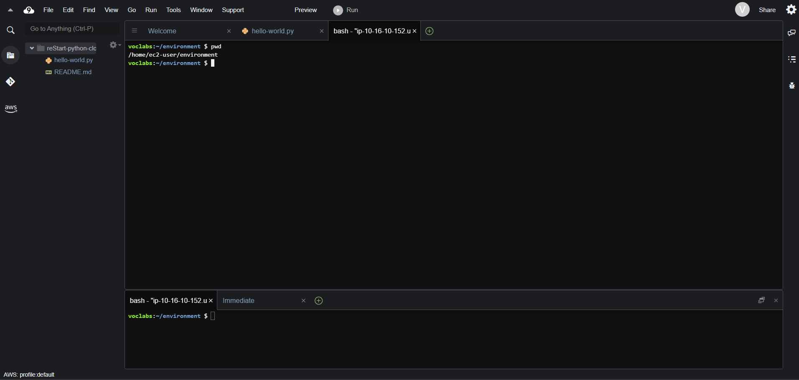
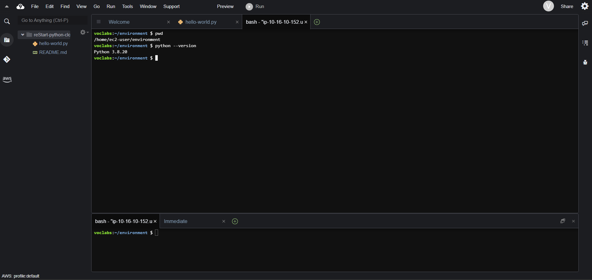
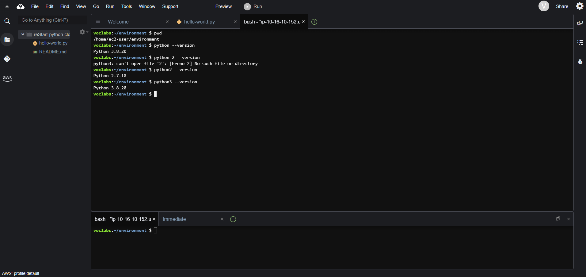
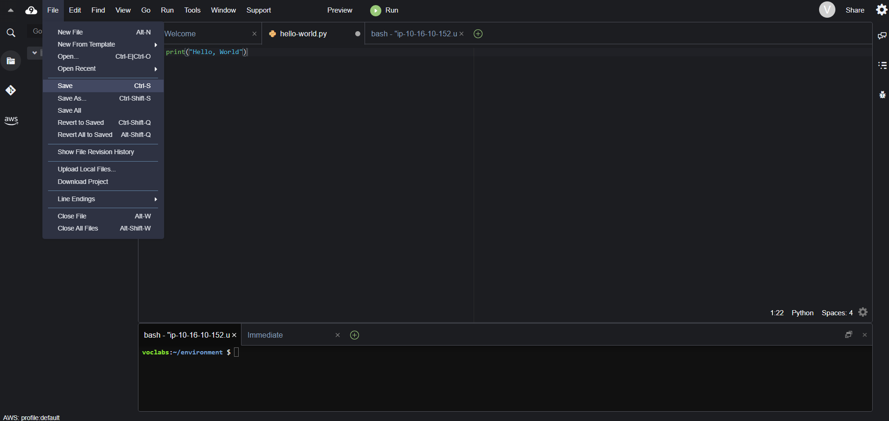
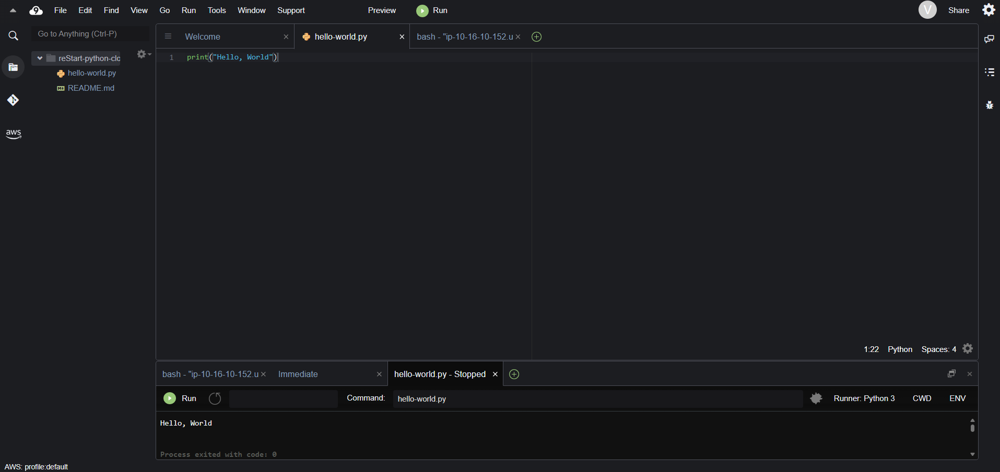

## LAB GUIDE: Creating a Hello, World Program (Python)

---

## Lab Overview
In this lab, you will use the Python programming language to write and execute your first program. You will work in the AWS Cloud9 IDE, verify the Python environment, create a Python file, and run a simple Hello, World program.

---

## Objectives
By completing this lab, you will be able to:
- Access and use the AWS Cloud9 IDE
- Verify installed Python versions
- Create and save Python source files
- Write and run a basic Python program
- Confirm successful program execution

---

## Task 1: Access the AWS Cloud9 IDE

1. Choose **Start Lab** and wait until the lab status shows **ready**.
2. Open the **AWS Management Console**.
3. Navigate to **Services → Cloud9**.
4. In the **Your environments** panel, select **reStart-python-cloud9**.

5. Choose **Open IDE**.
6. If prompted:
   - Choose **Discard** for project settings changes
   - Choose **No** for third-party content prompts

**Expected Result:**  
The AWS Cloud9 IDE opens successfully.

---

## Task 2: Create a Python Exercise File

1. From the Cloud9 menu bar, choose **File → New From Template → Python File**.

2. Delete the sample code in the new file.
3. Choose **File → Save As**.
4. Name the file `hello-world.py`.
5. Save the file in the directory:
/home/ec2-user/environment

**Expected Result:**  
A new Python file is created and saved.

---

## Task 3: Access the Terminal Session

1. In the Cloud9 IDE, choose the **+** icon.
2. Select **New Terminal**.

3. In the terminal, confirm the working directory:
pwd

Expected Result:  
The working directory is /home/ec2-user/environment.

---

## Task 4: Verify Python Versions

1. In the terminal, check the default Python version: python --version

2. Check other available versions:

python2 --version  
python3 --version

Expected Result:  
Python 3.6.x is available and set as the default.

---

## Task 5: Write and Run the Hello, World Program

1. Open the hello-world.py file in the IDE.
2. Enter the following code: print("Hello, World")
3. Save the file.

 

4. Choose the Run (Play) button.
5. Observe the output in the bottom pane.

Expected Result:  
The message Hello, World is displayed.

---

### * What Was Learned in This Lab *

By following these steps, I learned how to:

- Access and navigate the AWS Cloud9 development environment.
- Create and manage Python source files.
- Understand Python as a high-level programming language.
- Verify installed Python versions using terminal commands.
- Write a basic Python program using the print() function.
- Execute Python code and confirm output in the IDE.

This lab forms a strong foundation for learning programming, automation, and scripting using Python in cloud-based environments.