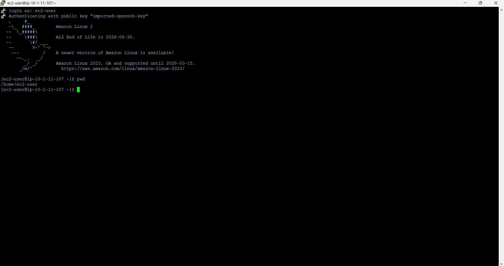
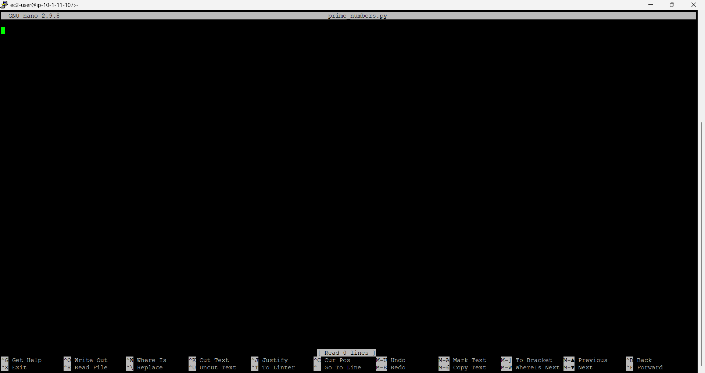
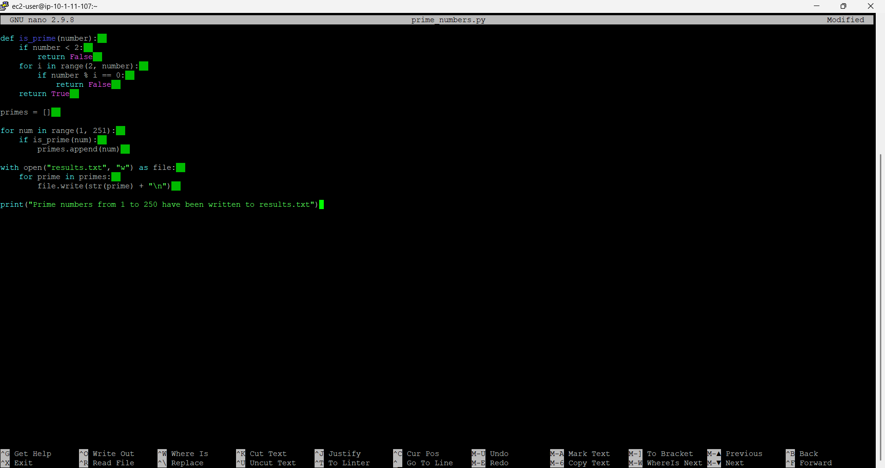
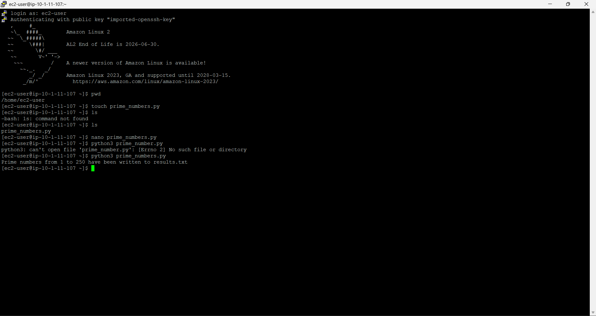
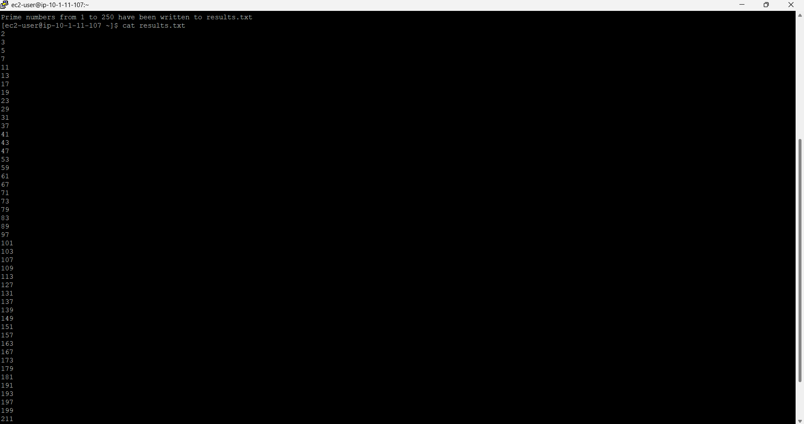
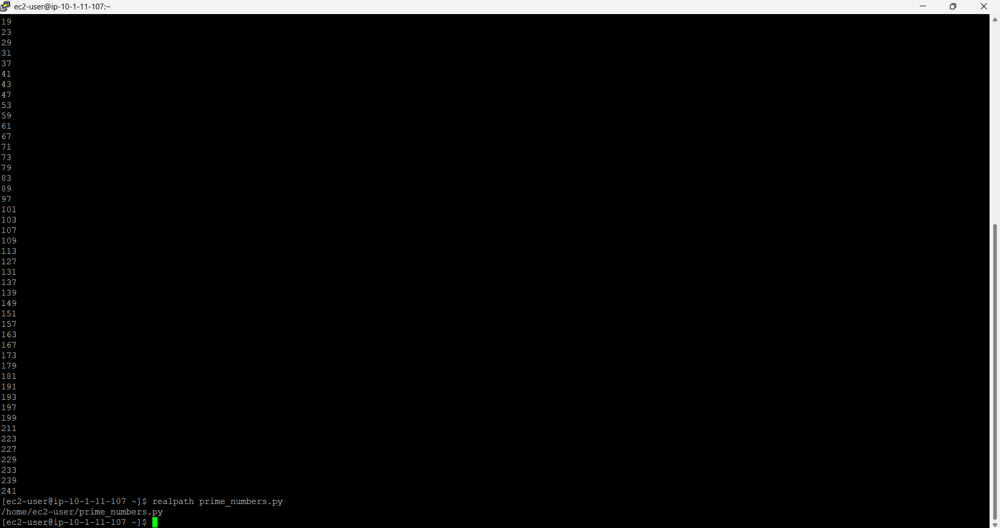

# Lab Guide: Prime Numbers Challenge Using Python

## Lab Overview
In this lab, you will create a Python script that identifies all prime numbers between 1 and 250 and saves them to a text file. You will use terminal commands to create, edit, execute, and verify the script and its output.

---

## Objectives
By completing this lab, you will be able to:
- Navigate a Linux file system using the terminal
- Create and edit Python scripts
- Write functions and loops in Python
- Save program output to a file
- Verify script execution and results

---

## Step 1: Open the Terminal and Confirm Your Location

1. Open a terminal session.
2. Confirm the working directory:
   pwd
Expected Result:  
The output shows:

/home/ec2-user/environment

---

## Step 2: Create a New Python Script

1. Create a new Python file: touch prime_numbers.py
2. Confirm the file exists: ls

Expected Result:  
The file `prime_numbers.py` is listed.

---

## Step 3: Open the Script in an Editor

1. Open the file using nano: nano prime_numbers.py

---

## Step 4: Write the Python Code

1. Copy and paste the following code into the editor:

# This script finds all prime numbers between 1 and 250 and saves them to a file called results.txt  

def is_prime(number):  
    if number < 2:  
        return False  
    for i in range(2, number):  
        if number % i == 0:  
            return False  
    return True  

primes = []  

for num in range(1, 251):  
    if is_prime(num):  
        primes.append(num)  

with open("results.txt", "w") as file:  
    for prime in primes:  
        file.write(str(prime) + "\n")  

print("Prime numbers from 1 to 250 have been written to results.txt")

---

## Step 5: Save and Exit the Editor

1. Press **CTRL + O**, then press **Enter** to save.  
2. Press **CTRL + X** to exit nano.

---

## Step 6: Run the Script Using Python 3

1. Execute the script: python3 prime_numbers.py

Expected Result:

Prime numbers from 1 to 250 have been written to results.txt

---

## Step 7: Verify the Output File

1. List files in the directory: ls

Expected Result:

prime_numbers.py  results.txt

---

## Step 8: View the Contents of results.txt

1. Display the file contents:

cat results.txt

Expected Result:  
The file starts with:

2  
3  
5  
7  
11  
...

and ends with:

241  
251

---

## Step 9: Confirm the Absolute Path of the Script

1. Run: realpath prime_numbers.py

Expected Result:

/home/ec2-user/environment/prime_numbers.py

---

## Step 10: Final Checklist

Requirement | Status  
Display primes from 1–250 | ✅  
Store results in results.txt | ✅  
Script tested | ✅  
Used Python 3 | ✅  
Absolute path recorded | ✅  

---

### * What Was Learned in This Lab *

By following these steps, I learned how to:

- Navigate and manage files using Linux terminal commands.
- Create, edit, and execute Python scripts.
- Write functions to implement logical checks.
- Use loops and conditionals to solve algorithmic problems.
- Save program output to a text file.
- Verify results and confirm script execution.
- Identify the absolute path of a script for reference.

This lab forms a strong foundation for programming, automation, and scripting tasks using Python in Linux and cloud environments.
