# Step-by-Step Guide: How I Built the Amazon Lex Quiz Chatbot (Part 2)

## Step 1: Access Amazon Lex
- Logged in to the AWS Management Console
- Selected a supported AWS Region (EU – Ireland or US East – N. Virginia)
- Used the search bar to find and open **Amazon Lex**

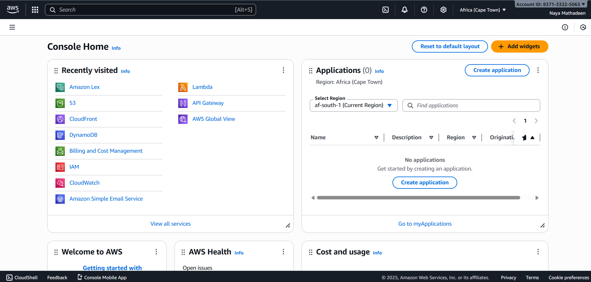

---

## Step 2: Create the Amazon Lex Bot
- Clicked **Create bot**
- Selected **Create a blank bot**
- Named the bot appropriately for the project
- Set the language to **English (ZA)**
- Selected **None** for advanced configuration
- Clicked **Create** to provision the bot

---

## Step 3: Create the Quiz Intent
- Navigated to **Intents** within the bot
- Created a new empty intent named `S3Quiz`

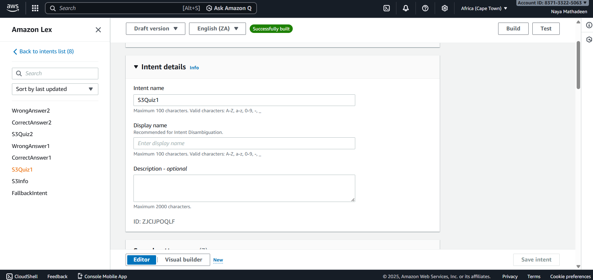

- Added sample utterances:
  - `Start quiz`
  - `Quiz me on S3`
  - `I am ready for the quiz`

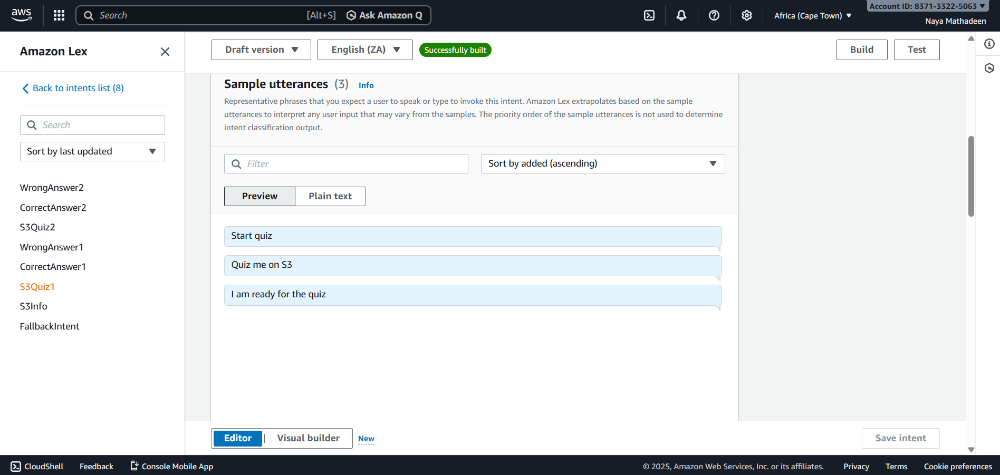

---

## Step 4: Add the Quiz Question
- Scrolled to the **Opening response** section of the `S3Quiz` intent
- Added the quiz question:
What does Amazon S3 stand for?

Answer A: Simple Storage Service
Answer B: Secure Server Storage
Answer C: Smart Storage System

Please type Answer A, Answer B, or Answer C.

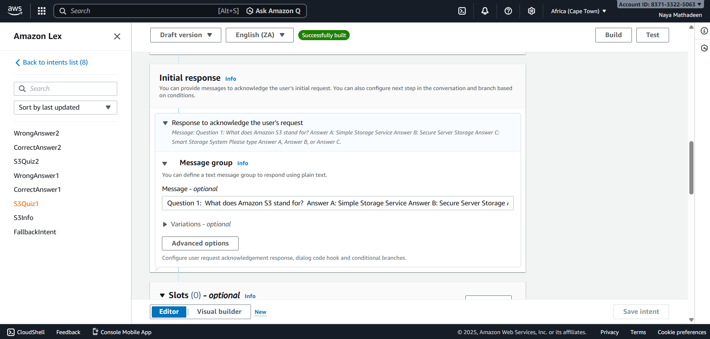

- Left the **Closing response** empty so the bot waits for user input
- Saved the intent

---

## Step 5: Create the Correct Answer Intent
- Created a new empty intent named `CorrectAnswer`

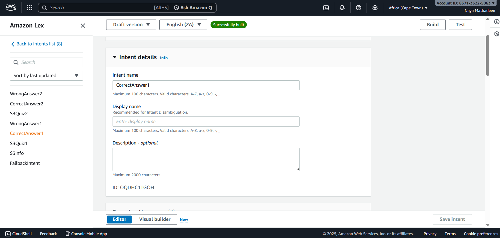

- Added sample utterances:
- `Answer A`
- `Simple Storage Service`

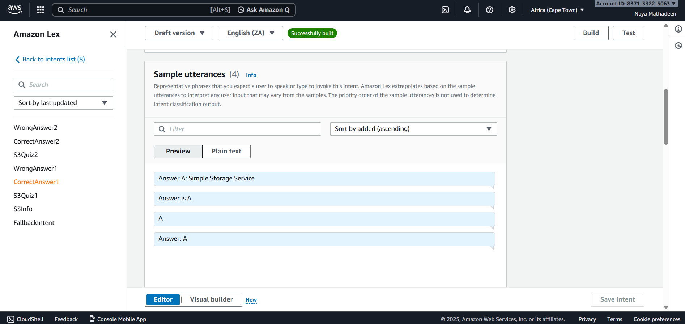

- Added the initial response:
Correct!
Amazon S3 stands for Simple Storage Service.

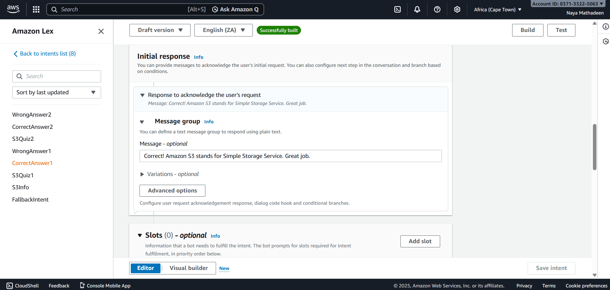

- Left the closing response empty
- Saved the intent

---

## Step 6: Create the Incorrect Answer Intent
- Created a new empty intent named `WrongAnswer`

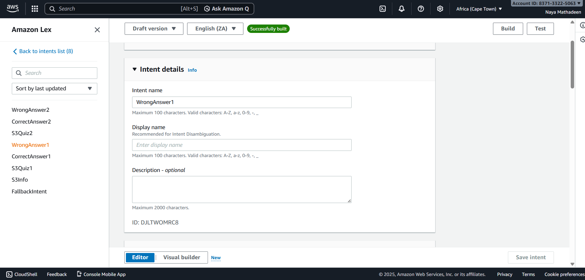

- Added sample utterances:
- `Answer B`
- `Answer C`
- `Secure Server Storage`
- `Smart Storage System`

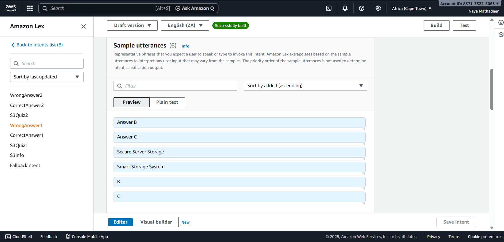

- Added the initial response:
Incorrect.
The correct answer is Simple Storage Service.

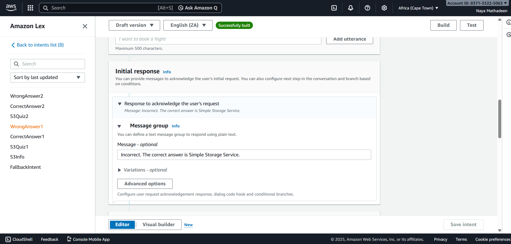

- Left the closing response empty
- Saved the intent

---

## Step 7: Build the Bot
- Clicked **Build** after saving all intents
- Waited for the build process to complete

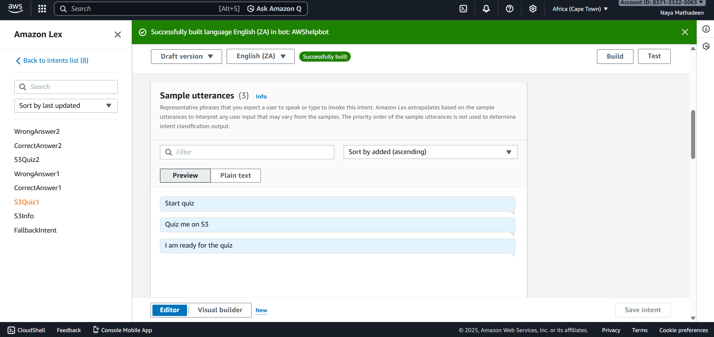

---

## Step 8: Test the Quiz
- Opened the **Test window** in Amazon Lex
- Typed `Start quiz` to begin
- Verified:
- `Answer A` returned the correct response
- `Answer B` or `Answer C` returned the incorrect response

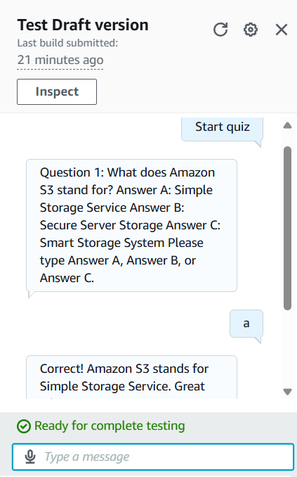

---

## Step 9: (Optional) Add a Second Quiz Question
- Created a new intent for Question 2
- Added an utterance such as `Start question 2`
- Added the second question in the opening response
- Reused the existing `CorrectAnswer` and `WrongAnswer` intents
- Built and tested the bot again

---

## Final Outcome
- Successfully built an interactive quiz chatbot using Amazon Lex V2
- Demonstrated intent-based conversation flow and branching logic
- Delivered a stable, user-friendly chatbot without backend code
