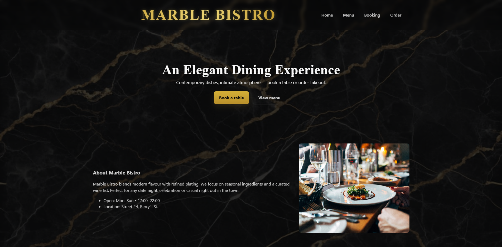
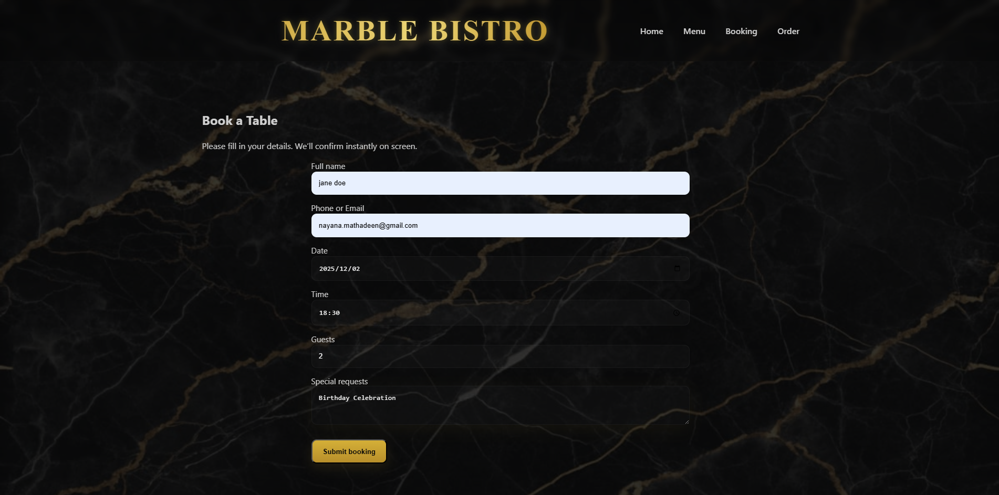
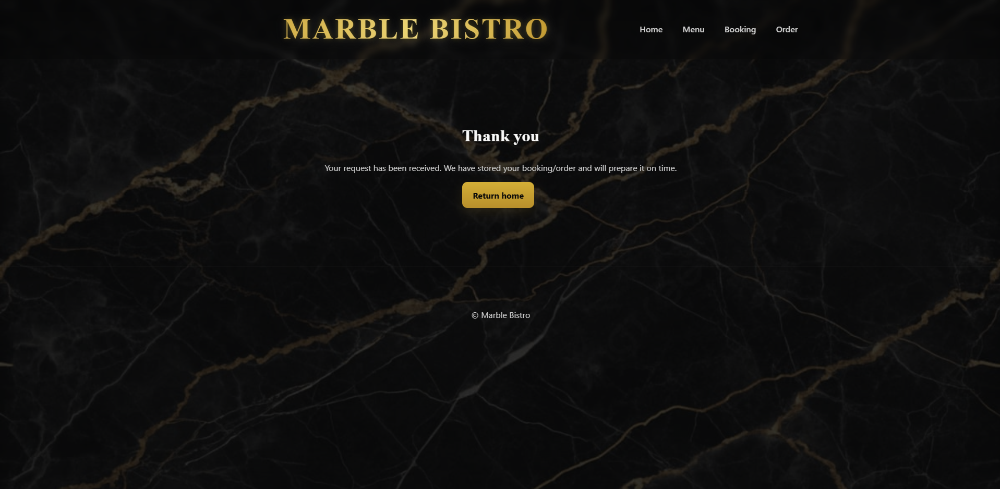
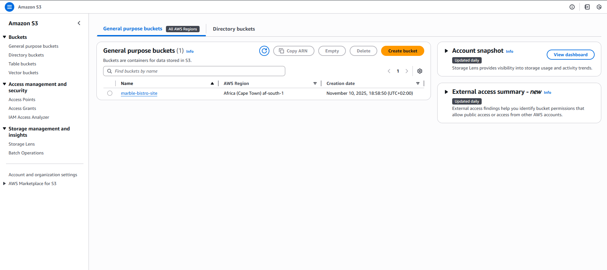
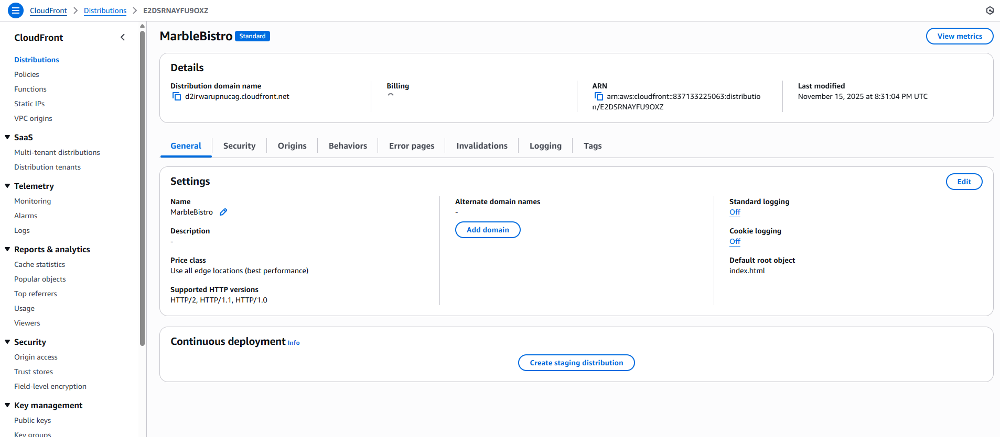
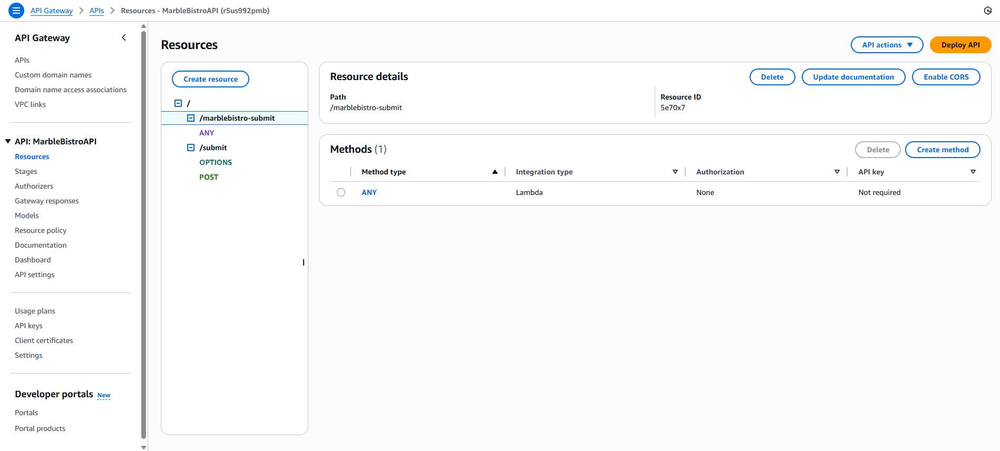
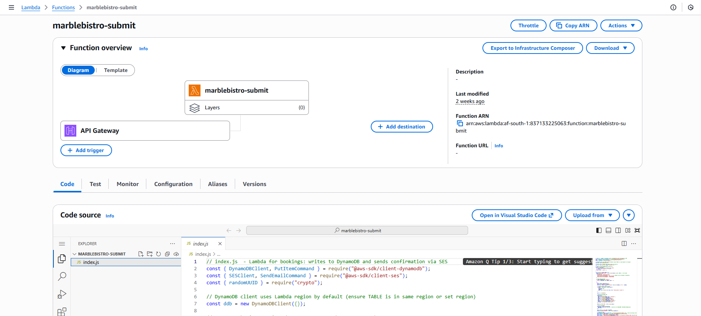
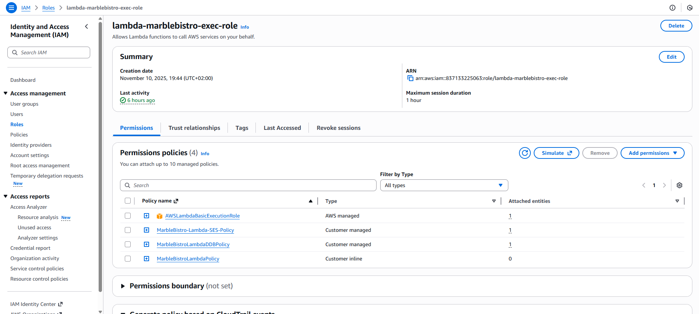

# Marble Bistro – Serverless Restaurant Booking Website  
A fully serverless, highly available restaurant website built using AWS services.  
This project hosts a static website on S3, delivers it globally through CloudFront, and processes bookings using API Gateway, Lambda, DynamoDB, and SES (sandbox mode).

---

# Table of Contents
1. [Project Overview](#project-overview)
2. [Project Phases](#project-phases)
   - [Phase 1: Planning and Architecture Design](#phase-1-planning-and-architecture-design)
   - [Phase 2: Frontend Development](#phase-2-frontend-development)
   - [Phase 3: Hosting Website on Amazon-S3](#phase-3-hosting-website-on-amazon-s3)
   - [Phase 4: Global Delivery with CloudFront](#phase-4-global-delivery-with-cloudfront)
   - [Phase 5: Backend Development with API-Gateway-and-Lambda](#phase-5-backend-development-with-api-gateway-and-lambda)
   - [Phase 6: Database Setup with DynamoDB](#phase-6-database-setup-with-dynamodb)
   - [Phase 7: SES Setup (Sandbox Mode)](#phase-7-ses-setup-sandbox-mode)
   - [Phase 8: IAM Role Configuration](#phase-8-iam-role-configuration)
   - [Phase 9: Testing and Validation](#phase-9-testing-and-validation)
3. [AWS Architecture Diagram](#aws-architecture-diagram)
4. [Final Architecture Summary](#final-architecture-summary)
5. [Project Status](#project-status)

---

# Project Overview

Marble Bistro is a modern restaurant website that includes animations, a flipbook-style menu, and a complete customer booking system.  
The project uses AWS serverless services to deliver a scalable, secure, and cost-effective solution.

---

# Project Phases

## Phase 1: Planning and Architecture Design

- Evaluated project requirements for hosting and booking functionality.
- Chose a fully serverless architecture to reduce maintenance and maximize scalability.
- Defined the data flow:
  - Static site → API request → Lambda → DynamoDB → SES.
- Decided to keep SES in sandbox mode for testing only.

---

## Phase 2: Frontend Development

### Website Creation

- Built pages using HTML, CSS, and JavaScript.
- Added GSAP and AOS animations for smooth transitions.
- Created a flipbook-style menu for a more interactive user experience.
- Implemented a booking form with a `fetch()` POST request to the backend.

### Booking Form Integration

Example of the booking form POST request:

    const API_URL = "https://<api-id>.execute-api.af-south-1.amazonaws.com/prod";

    fetch(`${API_URL}/submit`, {
        method: "POST",
        headers: {"Content-Type": "application/json"},
        body: JSON.stringify(payload)
    });

---

## Phase 3: Hosting Website on Amazon S3

- Created an S3 bucket for static hosting.
- Disabled **"Block all public access"**.
- Enabled Static Website Hosting:
  - index document: `index.html`
  - error document: `index.html`

---

## Project Files

- [index.html](./Marble-Bistro/index.html)
- [booking.html](./Marble-Bistro/booking.html)
- [confirmation.html](./Marble-Bistro/confirmation.html)
- [menu.html](./Marble-Bistro/menu.html)
- [order.html](./Marble-Bistro/order.html)
- [css/](./Marble-Bistro/css/styles.css)
- [js/](./Marble-Bistro/js/app.js)
- [lambds/](./Marble-Bistro/lambds/handler.js)
- [images/](./Marble-Bistro/Images/)

- Ensured correct file metadata (for example, JavaScript → `application/javascript`).

---

## Phase 4: Global Delivery with CloudFront

- Created a CloudFront distribution pointing to the S3 static website endpoint.
- Enabled HTTPS using the default CloudFront certificate.
- Used cache invalidation to refresh updated files, such as:

    /js/app.js  
    /*

- CloudFront ensured fast global load times.

---

## Phase 5: Backend Development with API Gateway and Lambda

### API Gateway

- Created a REST API (not HTTP API).
- Resource created: `/submit`
- Method added: `POST`
- Enabled Lambda Proxy Integration.
- Configured CORS (OPTIONS + POST).
- Deployed API to `prod`.

### Lambda Function

- Function name: `marblebistro-submit`
- Runtime: Node.js 20.x
- Added environment variable:

    TABLE_NAME = MarbleBistroSubmissions

**Lambda responsibilities:**

- Parse input.
- Validate booking fields.
- Write booking to DynamoDB.
- Send SES email to verified addresses only.
- Log everything to CloudWatch for debugging.

---

## Phase 6: Database Setup with DynamoDB

### Table Creation

- Table name: `MarbleBistroSubmissions`
- Partition key: `submissionId` (String)

### Stored Fields

- `submissionId`
- `name`
- `contact`
- `date`
- `time`
- `guests`
- `notes`
- `createdAt`

---

## Phase 7: SES Setup (Sandbox Mode)

- Region used: `us-east-1`
- Verified sender email:

    reservationsmarblebistro@gmail.com

- Verified test recipient emails.

SES remains in **sandbox mode**:

- Can only send to verified emails.
- Suitable for controlled testing.

---

## Phase 8: IAM Role Configuration

The Lambda execution role required permissions for:

### DynamoDB

- `dynamodb:PutItem`
- `dynamodb:UpdateItem`
- `dynamodb:GetItem`

### SES

- `ses:SendEmail`
- `ses:SendRawEmail`

### CloudWatch Logs

- `logs:CreateLogGroup`
- `logs:CreateLogStream`
- `logs:PutLogEvents`

These permissions allowed Lambda to store data, send emails, and generate logs.

---

## Phase 9: Testing and Validation

### End-to-End Flow

1. Customer submits booking form.  
2. API Gateway receives request.  
3. Lambda is triggered and validates inputs.  
4. DynamoDB stores booking data.  
5. SES sends confirmation email to a verified address.  
6. CloudWatch logs confirm successful execution.

All components were tested successfully and worked as expected.

---

# AWS Architecture Diagram

    +----------------------+          
    |      CloudFront      |          
    | (Global CDN & HTTPS) |          
    +----------+-----------+          
               |                      
               v                      
    +----------------------+          
    |        S3            |          
    |   (Static Website)   |          
    +----------+-----------+          
               |                      
               v                      
      Customer Submits Booking        
               |                      
               v                      
    +----------------------+          
    |    API Gateway       |          
    | (RESTful Endpoint)   |          
    +----------+-----------+          
               |                      
               v                      
    +----------------------+          
    |       Lambda         |          
    | (Booking Processor)  |          
    +----+-----------+-----+          
         |           |                
         v           v                
+------------------+   +------------------+
|    DynamoDB      |   |       SES        |
| (Booking Storage)|   | (Verified Emails |
|                  |   |   Only – Sandbox)|
+------------------+   +------------------+

---

# Final Architecture Summary

- The frontend is stored in S3 and delivered through CloudFront.
- API Gateway exposes a secure API endpoint for the booking system.
- Lambda handles backend logic on demand.
- DynamoDB stores booking data reliably and at scale.
- SES sends booking confirmation emails to verified test addresses.

This architecture is entirely serverless and requires no infrastructure management, making it cost-efficient and highly scalable.

---

# Project Status

The booking system is fully functional, including:

- Static hosting  
- Global delivery  
- Secure backend processing  
- DynamoDB booking storage  
- SES email verification flow  

SES production mode was intentionally not enabled.

---

